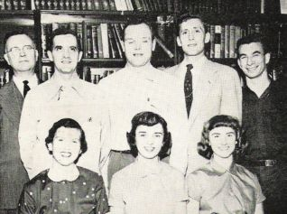

# The Wagner Collection
## Field Journal, 1955–1969

    
   <a rel="license" href="http://creativecommons.org/licenses/by-sa/4.0/">Creative
   Commons Attribution-ShareAlike 4.0 International License</a>.

* * *

[Click HERE to hear Mrs. Wagner](audio/001.mp3)

## FORWARD

### What is this website about?

In this web site are words.   They are the words of Mrs. Ruth Wagner who
describes the fourteen years [1955 to 1969] she and her husband,
Reverend William P. Wagner, spent as a missionary team in the highlands
of New Guinea.  In 1955, William P. Wagner [Bill for short], a 34-year old
Lutheran Church - Missouri Synod Springfield, Illinois, seminary graduate,
and his bride, Ruth, a former public school teacher in Toledo, Ohio,
willingly left the United States to set foot in a new land.  Only nine other
missionaries had been there before them.

As she relates her story, Mrs. Ruth Wagner shares her memories,
thoughts, feelings; many photographs, films, conference papers, and
mission newsletters describing their encounters with the Enga, Hewa, and
Duna people of New Guinea.  As much as I have tried to put her story
into a respectable format, so that she could share this knowledge with
the world, I am fully aware that I cannot possibly capture all the verve
and excitement this journey created.  However, I hope I did it justice.

To fully enjoy this web book, photos and maps can expand and return to
normal size by simply "clicking" on them.  The film and audio clips
complement the Wagner story, and are accessed in the same manner.
The conference papers, mission newsletters, photos, and films used to
create this website were all donated by Mrs. Ruth Wagner, unless cited
otherwise.  The complete collection is available for viewing on DVD media
at the Neff Hall Anthropology Library, the Lowell D. Holmes Museum of
Anthropology in Neff Hall on the Wichita State University Campus, or at
the Wichita State University Library in the Special Collections department.
Enjoy!

[Click HERE to hear Mrs. Wagner](audio/003.mp3)

## ACKNOWLEDGMENTS

I would like to give special thanks to all the people who helped put this
project together.  I will first start with Mrs. Ruth Wagner, whose generous
spirit, delightful enthusiasm, and sense of humor, made the project
possible.

I would also like to thank Mr. Jerry Martin, Dr. David Hughes, Dr. Dorothy
Billings, and Dr. Jay Price, whose help and guidance kept me on a straight
and narrow path.  Additionally, I would like to thank Sue Cowdery, the
Registrar at the Lowell D. Holmes Museum of Anthropology, and other
museum students for all their help with the collection throughout this
project.

Special thanks to Muhammad Jamil for his computer savviness and
expertise.  He played an integral role in incorporating flash and special
effects into my website. Thanks to Macc for the web book template, for
without it, the pages would not turn - an aspect very important for the
book effect.  Also, thanks to Troy Belford for educating me on various
aspects of film editing technology.  His expertise in converting from
analog to digital media provided me with much insight.
Last but not least, I would like to thank my loving family, Michael and
Tyler, without whose support this project would never have gotten off the
ground.  To one and all, a very big and heartfelt Thank You!

Shawnie J. Imbert

B.A., M.A. Anthropology

[Click HERE to hear Mrs. Wagner](audio/005.mp3)

## CONTENTS

**Home**:

* [Lowell D. Holmes Museum of Anthropology](http://holmes.anthropology.museum/)
* [Contact Us](http://www.holmes.anthropology.museum/message/contact0.asp)

**[Forward](#forward)**:

* [What is this Website About?](#what-is-this-website-about)
* [Acknowledgements](#acknowledgments)
* [Contents](#contents)
* Pronunciation Key

**Chapter 1**: The Wagner Story

* [Mission Work and The Lutheran Church – Missouri Synod](#mission-work-and-the-lutheran-church---missouri-synod)
* [The Beginning – William P. Wagner and Ruth L. Prueter](#the-beginning---william-p-wagner)
* [Marriage Proposal – Then off to New Guinea!](marriage-proposal---then-off-to-new-guinea)
* [Starting a New Life Together – Arriving in New Guinea](#starting-a-new-life-together--arriving-in-papua-new-guinea)
* [Bush houses – How they are built](#bush-houses---how-they-are-built)
* [Home Away from Home – Getting Settled](#home-away-from-home---getting-settled)
* Mrs. Ruth Wagner – A Missionary Wife’s Life
* Raising a Family - In New Guinea
* Christmas – Away From Home
* Reverend William Wagner – His Missionary Duties
* Keeping in Touch – Communication New Guinean Style
* Traveling in New Guinea – The Making of Roads
* Bridges – Connecting Roads
* New Guinean “Walkabout”
* Going Home

[Click HERE to hear Mrs. Wagner](audio/007.mp3)

**Chapter 2**: Western Highlands

* Where is Enga Province?
* Who are the People of Enga Province? – An Introduction
* Enga Concepts – An Overview
* Birth & Family
* Childhood
* Houses – The Man’s House and the Woman’s House
* Clan
* Marriage, Adultery
* Death, Sorrow, and Grief
* Clothing
* Gardens
* Ceremonial Grounds
* Trade and Commerce
* Skills & Handicrafts
* Change

**Chapter 3**: Southern Highlands

* Location, Location, Location
* The Duna—The Hewa

**Chapter 4**:
 Mrs. Ruth Wagner - Synopsis

**Chapter 5**:

* Production Credits

**Chapter 6**:

* Maps

**Chapter 7**:

* The Wagner Collection

[Mission area map - circa 1961](images/009-01.jpg)

[Click HERE to hear Mrs. Wagner](audio/009.mp3)

## MISSION WORK AND THE LUTHERAN CHURCH - Missouri Synod

The Highland Mountains were inhabited by some of the most primitive people
on earth.  Of all the mission fields in Asia, the Highlands of Papua New
Guinea were areas where Western civilization had been the last to arrive.
The terrain was mountainous, forested and, as one might not expect, highly
populated.

Initially, the missionaries faced a tremendous problem of language.  In fact,
in a single church district of 10,000, the only language spoken was Enga and
its dialects. The language had never been put into writing.
Reverend William and Mrs. Ruth Wagner were members of the Lutheran
Church - Missouri Synod.  They were first sent to do mission work with the
Enga People in Raiakama, or as Mrs. Wagner fondly calls it "The Saka."
Pidgin English was taught to a few Enga by earlier missionaries, so the
Wagners had to first learn Pidgin English in order to communicate with the
Enga people through an interpreter.
The Wagners worked in Raiakama for a total of five years (1955-1960),
during which time, Reverend Wagner added Enga to his repertoire of
languages.  In 1960, it was time for the Wagners to go home on furlough to
spend a year visiting family and friends in the United States.
During the second term, 1961-1965, Reverend Wagner was a circuit
missionary among the Yakuman people of Mambisanda,  also the chaplin for
the hospital at the Mambisanda station.  He was also asked to open the
Kopiago area in the Southern Province of New Guinea in which lived the
Duna people, later making exploratory forays into the previous uncontacted
Hewa area.  Enga and Duna interpreters accompanied the group.  The
Wagner family moved to Kopiago and in 1965 went on furlough for six (6)
months.

[Click HERE to hear Mrs. Wagner](audio/010.mp3)

[Click HERE to hear Mrs. Wagner](audio/011.mp3)

When they returned to New Guinea for another four (4) year stint, the
Wagners went to Sirunki (1965-1969) and remained there, doing God’s
work.  In 1969, the Wagner family decided to permanently return home to
the United States.

Besides its work in evangelism, much, much more was going on with the
mission.  Missionaries taught reading and writing, hygiene, sewing, and
introduced modern tools (Lutheran Churches of the World, pg. 208).  The
mission also built a much-needed hospital for the New Guinean people,
schools for the New Guinean and missionary children, and provided
literacy classes that taught New Guinean adults how to read and write
their own language.

Newly-built, missionary run, trade stores not only bought and sold
produce for themselves, but also introduced to the New Guinean people a
money economy and honest business practices.  In essence, the church
played a vital role in the adjustment of the Highlands to the modern
world, a responsibility it took seriously.
The Wagner’s church, The Lutheran Church - Missouri Synod, began work
in Papua New Guinea in 1948, at the invitation of a Wauni tribal leader in
Yaramanda, Enga Province.
<http://www.lcms.org/pages/print.asp?print=1&NavID=5917&path>

[Click HERE to hear Mrs. Wagner](audio/012.mp3)

[Click HERE to watch movie clip](video/Life.wmv)

[Click HERE to hear Mrs. Wagner](audio/014.mp3)

## THE BEGINNING - William P. Wagner

William (Bill) P. Wagner, the son of Mr. and Mrs. Philip G Wagner, was
born and raised on a farm in Hudson, Colorado, (Trinity Lutheran Church
Bulletin; Greenly Colo. Febr.13, 1955)  During his earlier years, he had
no vision of becoming a pastor; that kind of life seemed too dull and
restricting.

In 1939, a farm accident marred his face and almost took his life.
Because of a farm injury he was not able to serve in the Armed Forces
during the Second World War.  However, since many mechanics had
been drafted, which had reduced the supply on the home front, he
enrolled in a national defense training course in mechanics.  From that
time onward, Bill Wagner used his mechanical abilities as a farmer with
his father and brother in Colorado, and as a missionary in New Guinea.

Later on, quite by accident, he was asked to teach Sunday School as a
substitute.  After he had taught Sunday School for a couple of years, his
pastor recognized his aptitude and encouraged him to go to Concordia
Seminary in Springfield, Illinois, which he entered in 1948 (The Lutheran
Witness. Jan 21, 1964. Triple-threat Missionary. May, Edward C.).
This was the BEGINNING of his life as a Pastor; William Wagner spent
his vicarage at St. Johns Church in West Bend, Wisconsin, and
graduated on June 4, 1954.

[Click HERE to hear Mrs. Wagner](audio/015.mp3)

## MARRIAGE PROPOSAL - Then Off to New Guinea!

Two months later, William Wagner proposed marriage to Ohioan Ruth L.
Prueter and they were married on August 14, 1954 in Memorial Lutheran
Church in Toledo, Ohio.  Ruth, the daughter of Mr. and Mrs. Henry W.
Prueter, was born and raised in Toledo, Ohio.  She attended the University
of Toledo, graduating in June 1948, with a Bachelor of Education degree.
Afterwards, she taught in the Toledo public schools for six years.

In preparation for their work in the mission field in New Guinea, both Mr.
and Mrs. William Wagner attended the Mission School at Concordia
Seminary, in Saint Louis, from September, 1954 to January, 1955.
William Wagner and his bride, Mrs. Ruth Wagner then returned to
Greeley, Colorado, where William (Bill) Wagner was ordained and
commissioned as a missionary to New Guinea at 3 p.m., February 13,
1955.  (The Lutheran Witness; St. Louis MO., March15, 1955)

Reverend and Mrs. William P. Wagner then left for San Francisco,
California where they boarded a plane for Madang (The Lutheran Witness;
St. Louis MO., March15, 1955).

Their final destination was the Western Highlands of Papua, New Guinea
where they were to work with the Enga, and later make exploratory trips
into the Hewa territories.

[Click HERE to hear Mrs. Wagner](audio/016.mp3)

## STARTING A NEW LIFE TOGETHER – Arriving in Papua, New Guinea

In March 1955, Reverend William and Ruth Wagner's plane touched down in
New Guinea.  Reverend Wagner writes:

> “As our plane circled over Yaramanda, we could see people running
> out of houses and looking up at us.  The plane continued on a short
> distance; we looked back and saw the crowd dissolve into a line and
> the far end of the line start toward the air-strip.  The crowd came
> streaming down the hill as the plane came over the strip and
> dropped down to land.  The Cessna taxied to a stop and the moment
> the propeller stopped turning the plane was surrounded by a
> hundred or more natives.  Everyone wanted to shake hands with us
> and welcome us to Yaramanda.  To whooping and the chanting, we
> climbed the long hill to the station.  We had arrived in New Guinea.”
> (Wagner Newsletter, May 9, 1955).

Their first stop was the station at Yaramanda, the home of pioneer
Missionary Otto Hintze, one of the first missionaries in the Highlands
(arrival in 1948), who was in charge of this circuit. This would be the
Wagner's home for the next two months, until they would continue on to
Saka Raiakama to begin a new main station and circuit of their own.

[Click HERE to hear Mrs. Wagner](audio/018.mp3)

Both Enga men and women construct blind walls. Shown above, a woman
splitting the bamboo, preparing it for pounding

[Click HERE to view movie clip](video/WallBuilding.wmf)

## BUSH HOUSES - How they are built

Bush houses, like the one Reverend William and Mrs. Ruth Wagner lived
in when they arrived in Yaramanda and also similar to their living quarters
in Saka Raiakama, were built mostly of saplings, trees, and grass, with
sawn lumber only used for doors and door frames, window frames, and
window sills.

[Click HERE to hear Mrs. Wagner](audio/Pg20a.mp3)

These houses were only temporary accommodations for the missionaries,
although they lived in them for years.  The Bush houses would eventually
be replaced by permanent frame-houses built by mission carpenters.
The Wagners would finally receive their permanent house in May of
1958, and it had some modern conveniences, including piped-in water
for the kitchen and bath.  This water came from a large metal tank
designed to catch rain water.

[Click HERE to hear Mrs. Wagner](audio/Pg20b.mp3)

[Click HERE to hear Mrs. Wagner](audio/Pg21b.mp3)

[Click HERE to hear Mrs. Wagner](audio/Pg21a.mp3)

## HOME AWAY FROM HOME - Getting Settled

Four months later, in August 1955, the Wagners officially moved to
Raiakama and began work at the new main station.  The house where
they would live would take some getting used to.  Mrs. Ruth Wagner
states:

> “The first sight of our home was almost like looking at a lone
> tree in the midst of dirt”
> (Wagner Newsletter, pg 7, September 1955).

She continues to explain the nature of Bush house:

[Click HERE to hear Mrs. Wagner](audio/Pg22.mp3)

==> text/023.txt <==
