# The Wagner Collection
## Field Journal, 1955–1969

    
   <a rel="license" href="http://creativecommons.org/licenses/by-sa/4.0/">Creative
   Commons Attribution-ShareAlike 4.0 International License</a>.

* * *

[Click HERE to hear Mrs. Wagner](audio/001.mp3)

## FORWARD

### What is this website about?

In this web site are words.   They are the words of Mrs. Ruth Wagner who
describes the fourteen years [1955 to 1969] she and her husband,
Reverend William P. Wagner, spent as a missionary team in the highlands
of New Guinea.  In 1955, William P. Wagner [Bill for short], a 34-year old
Lutheran Church - Missouri Synod Springfield, Illinois, seminary graduate,
and his bride, Ruth, a former public school teacher in Toledo, Ohio,
willingly left the United States to set foot in a new land.  Only nine other
missionaries had been there before them.

As she relates her story, Mrs. Ruth Wagner shares her memories,
thoughts, feelings; many photographs, films, conference papers, and
mission newsletters describing their encounters with the Enga, Hewa, and
Duna people of New Guinea.  As much as I have tried to put her story
into a respectable format, so that she could share this knowledge with
the world, I am fully aware that I cannot possibly capture all the verve
and excitement this journey created.  However, I hope I did it justice.

To fully enjoy this web book, photos and maps can expand and return to
normal size by simply "clicking" on them.  The film and audio clips
complement the Wagner story, and are accessed in the same manner.
The conference papers, mission newsletters, photos, and films used to
create this website were all donated by Mrs. Ruth Wagner, unless cited
otherwise.  The complete collection is available for viewing on DVD media
at the Neff Hall Anthropology Library, the Lowell D. Holmes Museum of
Anthropology in Neff Hall on the Wichita State University Campus, or at
the Wichita State University Library in the Special Collections department.
Enjoy!

[Click HERE to hear Mrs. Wagner](audio/003.mp3)

## ACKNOWLEDGMENTS

I would like to give special thanks to all the people who helped put this
project together.  I will first start with Mrs. Ruth Wagner, whose generous
spirit, delightful enthusiasm, and sense of humor, made the project
possible.

I would also like to thank Mr. Jerry Martin, Dr. David Hughes, Dr. Dorothy
Billings, and Dr. Jay Price, whose help and guidance kept me on a straight
and narrow path.  Additionally, I would like to thank Sue Cowdery, the
Registrar at the Lowell D. Holmes Museum of Anthropology, and other
museum students for all their help with the collection throughout this
project.

Special thanks to Muhammad Jamil for his computer savviness and
expertise.  He played an integral role in incorporating flash and special
effects into my website. Thanks to Macc for the web book template, for
without it, the pages would not turn - an aspect very important for the
book effect.  Also, thanks to Troy Belford for educating me on various
aspects of film editing technology.  His expertise in converting from
analog to digital media provided me with much insight.
Last but not least, I would like to thank my loving family, Michael and
Tyler, without whose support this project would never have gotten off the
ground.  To one and all, a very big and heartfelt Thank You!

Shawnie J. Imbert

B.A., M.A. Anthropology

[Click HERE to hear Mrs. Wagner](audio/005.mp3)

## CONTENTS

**Home**:

* [Lowell D. Holmes Museum of Anthropology](http://holmes.anthropology.museum/)
* [Contact Us](http://www.holmes.anthropology.museum/message/contact0.asp)

**[Forward](#forward)**:

* [What is this Website About?](#what-is-this-website-about)
* [Acknowledgements](#acknowledgments)
* [Contents](#contents)
* [Pronunciation Key](#pronunciation-key)

**Chapter 1**: The Wagner Story

* [Mission Work and The Lutheran Church – Missouri Synod](#mission-work-and-the-lutheran-church---missouri-synod)
* [The Beginning – William P. Wagner and Ruth L. Prueter](#the-beginning---william-p-wagner)
* [Marriage Proposal – Then off to New Guinea!](marriage-proposal---then-off-to-new-guinea)
* [Starting a New Life Together – Arriving in New Guinea](#starting-a-new-life-together--arriving-in-papua-new-guinea)
* [Bush houses – How they are built](#bush-houses---how-they-are-built)
* [Home Away from Home – Getting Settled](#home-away-from-home---getting-settled)
* [Mrs. Ruth Wagner – A Missionary Wife’s Life](#mrs-ruth-wagner---a-missionary-wifes-life)
* [Raising a Family - In New Guinea](#raising-a-family--in-new-guinea)
* [Christmas – Away From Home](#christmas---away-from-home)
* [Reverend William Wagner – His Missionary Duties](#reverend-william-p-wagner---his-missionary-duties)
* [Keeping in Touch – Communication New Guinean Style](#keeping-in-touch---communication-new-guinea-style)
* [Traveling in New Guinea – The Making of Roads](#traveling-in-new-guinea---the-making-of-roads)
* [Bridges – Connecting Roads](#bridges---connecting-roads)
* [New Guinean “Walkabout”](#a-new-guinean-walkabout)
* Going Home

[Click HERE to hear Mrs. Wagner](audio/007.mp3)

**Chapter 2**: Western Highlands

* Where is Enga Province?
* Who are the People of Enga Province? – An Introduction
* Enga Concepts – An Overview
* Birth & Family
* Childhood
* Houses – The Man’s House and the Woman’s House
* Clan
* Marriage, Adultery
* Death, Sorrow, and Grief
* Clothing
* Gardens
* Ceremonial Grounds
* Trade and Commerce
* Skills & Handicrafts
* Change

**Chapter 3**: Southern Highlands

* Location, Location, Location
* The Duna—The Hewa

**Chapter 4**:
 Mrs. Ruth Wagner - Synopsis

**Chapter 5**:

* Production Credits

**Chapter 6**:

* Maps

**Chapter 7**:

* The Wagner Collection

[Mission area map - circa 1961](images/009-01.jpg)

[Click HERE to hear Mrs. Wagner](audio/009.mp3)

## MISSION WORK AND THE LUTHERAN CHURCH - Missouri Synod

The Highland Mountains were inhabited by some of the most primitive people
on earth.  Of all the mission fields in Asia, the Highlands of Papua New
Guinea were areas where Western civilization had been the last to arrive.
The terrain was mountainous, forested and, as one might not expect, highly
populated.

Initially, the missionaries faced a tremendous problem of language.  In fact,
in a single church district of 10,000, the only language spoken was Enga and
its dialects. The language had never been put into writing.
Reverend William and Mrs. Ruth Wagner were members of the Lutheran
Church - Missouri Synod.  They were first sent to do mission work with the
Enga People in Raiakama, or as Mrs. Wagner fondly calls it "The Saka."
Pidgin English was taught to a few Enga by earlier missionaries, so the
Wagners had to first learn Pidgin English in order to communicate with the
Enga people through an interpreter.
The Wagners worked in Raiakama for a total of five years (1955-1960),
during which time, Reverend Wagner added Enga to his repertoire of
languages.  In 1960, it was time for the Wagners to go home on furlough to
spend a year visiting family and friends in the United States.
During the second term, 1961-1965, Reverend Wagner was a circuit
missionary among the Yakuman people of Mambisanda,  also the chaplin for
the hospital at the Mambisanda station.  He was also asked to open the
Kopiago area in the Southern Province of New Guinea in which lived the
Duna people, later making exploratory forays into the previous uncontacted
Hewa area.  Enga and Duna interpreters accompanied the group.  The
Wagner family moved to Kopiago and in 1965 went on furlough for six (6)
months.

[Click HERE to hear Mrs. Wagner](audio/010.mp3)

[Click HERE to hear Mrs. Wagner](audio/011.mp3)

When they returned to New Guinea for another four (4) year stint, the
Wagners went to Sirunki (1965-1969) and remained there, doing God’s
work.  In 1969, the Wagner family decided to permanently return home to
the United States.

Besides its work in evangelism, much, much more was going on with the
mission.  Missionaries taught reading and writing, hygiene, sewing, and
introduced modern tools (Lutheran Churches of the World, pg. 208).  The
mission also built a much-needed hospital for the New Guinean people,
schools for the New Guinean and missionary children, and provided
literacy classes that taught New Guinean adults how to read and write
their own language.

Newly-built, missionary run, trade stores not only bought and sold
produce for themselves, but also introduced to the New Guinean people a
money economy and honest business practices.  In essence, the church
played a vital role in the adjustment of the Highlands to the modern
world, a responsibility it took seriously.
The Wagner’s church, The Lutheran Church - Missouri Synod, began work
in Papua New Guinea in 1948, at the invitation of a Wauni tribal leader in
Yaramanda, Enga Province.
<http://www.lcms.org/pages/print.asp?print=1&NavID=5917&path>

[Click HERE to hear Mrs. Wagner](audio/012.mp3)

[Click HERE to watch movie clip](video/Life.wmv)

[Click HERE to hear Mrs. Wagner](audio/014.mp3)

## THE BEGINNING - William P. Wagner

William (Bill) P. Wagner, the son of Mr. and Mrs. Philip G Wagner, was
born and raised on a farm in Hudson, Colorado, (Trinity Lutheran Church
Bulletin; Greenly Colo. Febr.13, 1955)  During his earlier years, he had
no vision of becoming a pastor; that kind of life seemed too dull and
restricting.

In 1939, a farm accident marred his face and almost took his life.
Because of a farm injury he was not able to serve in the Armed Forces
during the Second World War.  However, since many mechanics had
been drafted, which had reduced the supply on the home front, he
enrolled in a national defense training course in mechanics.  From that
time onward, Bill Wagner used his mechanical abilities as a farmer with
his father and brother in Colorado, and as a missionary in New Guinea.

Later on, quite by accident, he was asked to teach Sunday School as a
substitute.  After he had taught Sunday School for a couple of years, his
pastor recognized his aptitude and encouraged him to go to Concordia
Seminary in Springfield, Illinois, which he entered in 1948 (The Lutheran
Witness. Jan 21, 1964. Triple-threat Missionary. May, Edward C.).
This was the BEGINNING of his life as a Pastor; William Wagner spent
his vicarage at St. Johns Church in West Bend, Wisconsin, and
graduated on June 4, 1954.

[Click HERE to hear Mrs. Wagner](audio/015.mp3)

## MARRIAGE PROPOSAL - Then Off to New Guinea!

Two months later, William Wagner proposed marriage to Ohioan Ruth L.
Prueter and they were married on August 14, 1954 in Memorial Lutheran
Church in Toledo, Ohio.  Ruth, the daughter of Mr. and Mrs. Henry W.
Prueter, was born and raised in Toledo, Ohio.  She attended the University
of Toledo, graduating in June 1948, with a Bachelor of Education degree.
Afterwards, she taught in the Toledo public schools for six years.

In preparation for their work in the mission field in New Guinea, both Mr.
and Mrs. William Wagner attended the Mission School at Concordia
Seminary, in Saint Louis, from September, 1954 to January, 1955.
William Wagner and his bride, Mrs. Ruth Wagner then returned to
Greeley, Colorado, where William (Bill) Wagner was ordained and
commissioned as a missionary to New Guinea at 3 p.m., February 13,
1955.  (The Lutheran Witness; St. Louis MO., March15, 1955)

Reverend and Mrs. William P. Wagner then left for San Francisco,
California where they boarded a plane for Madang (The Lutheran Witness;
St. Louis MO., March15, 1955).

Their final destination was the Western Highlands of Papua, New Guinea
where they were to work with the Enga, and later make exploratory trips
into the Hewa territories.

[Click HERE to hear Mrs. Wagner](audio/016.mp3)

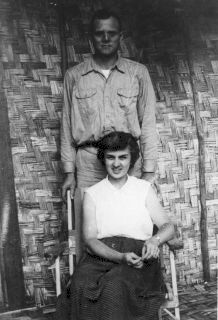

## STARTING A NEW LIFE TOGETHER – Arriving in Papua, New Guinea

In March 1955, Reverend William and Ruth Wagner's plane touched down in
New Guinea.  Reverend Wagner writes:

> “As our plane circled over Yaramanda, we could see people running
> out of houses and looking up at us.  The plane continued on a short
> distance; we looked back and saw the crowd dissolve into a line and
> the far end of the line start toward the air-strip.  The crowd came
> streaming down the hill as the plane came over the strip and
> dropped down to land.  The Cessna taxied to a stop and the moment
> the propeller stopped turning the plane was surrounded by a
> hundred or more natives.  Everyone wanted to shake hands with us
> and welcome us to Yaramanda.  To whooping and the chanting, we
> climbed the long hill to the station.  We had arrived in New Guinea.”
> (Wagner Newsletter, May 9, 1955).

Their first stop was the station at Yaramanda, the home of pioneer
Missionary Otto Hintze, one of the first missionaries in the Highlands
(arrival in 1948), who was in charge of this circuit. This would be the
Wagner's home for the next two months, until they would continue on to
Saka Raiakama to begin a new main station and circuit of their own.

[Click HERE to hear Mrs. Wagner](audio/018.mp3)

Both Enga men and women construct blind walls. Shown above, a woman
splitting the bamboo, preparing it for pounding

[Click HERE to view movie clip](video/WallBuilding.wmf)

## BUSH HOUSES - How they are built

Bush houses, like the one Reverend William and Mrs. Ruth Wagner lived
in when they arrived in Yaramanda and also similar to their living quarters
in Saka Raiakama, were built mostly of saplings, trees, and grass, with
sawn lumber only used for doors and door frames, window frames, and
window sills.

[Click HERE to hear Mrs. Wagner](audio/Pg20a.mp3)

These houses were only temporary accommodations for the missionaries,
although they lived in them for years.  The Bush houses would eventually
be replaced by permanent frame-houses built by mission carpenters.
The Wagners would finally receive their permanent house in May of
1958, and it had some modern conveniences, including piped-in water
for the kitchen and bath.  This water came from a large metal tank
designed to catch rain water.

[Click HERE to hear Mrs. Wagner](audio/Pg20b.mp3)

[Click HERE to hear Mrs. Wagner](audio/Pg21b.mp3)

[Click HERE to hear Mrs. Wagner](audio/Pg21a.mp3)

## HOME AWAY FROM HOME - Getting Settled

Four months later, in August 1955, the Wagners officially moved to
Raiakama and began work at the new main station.  The house where
they would live would take some getting used to.  Mrs. Ruth Wagner
states:

> “The first sight of our home was almost like looking at a lone
> tree in the midst of dirt”
> (Wagner Newsletter, pg 7, September 1955).

[Click HERE to hear Mrs. Wagner](audio/Pg22.mp3)

[Click HERE to hear Mrs. Wagner](audio/023-003.mp3)

[Click HERE to hear Mrs. Wagner](audio/023-001.mp3)

[Click HERE to hear Mrs. Wagner](audio/023-004.mp3)

[Click HERE to hear Mrs. Wagner](audio/023-002.mp3)

She continues to explain the nature of Bush house:

There were two rooms in the Bush house, each 15’ x 15’, of which one
was their bedroom.  This room was also a semi-storage room and
contained a shower.  The shower was a converted milking bucket with a
hose attached underneath, resembling a sprinkler can, and manipulated
up and down by means of a rope and pulley.  Water was heated on the
stove and brought to the bathroom.

The other room, a kitchen, contained a food-safe for the storage of food,
which was partly enclosed by a screen. There was a cabinet similar to a
buffet with two drawers on top and two large doors with shelves inside, a
6’ x 42” table which could easily accomodate ten people, four chairs, the
wood stove and firewood box, a counter and shelves along one side, a
shelf for holding the water buckets, plus odds-and-ends in corners and
various articles hanging on the walls.

The ceiling in the house had large strips of waterproof tar paper nailed to
saplings, with the paper extending from one end of the house to the
other.  This ceiling afforded a catch-all for fragments from the saplings
above dropping onto the table, food, bed, etc.  The walls were two [2]
layers of blind with kunai grass in between as insulation in which small
rats scurried up and down and also under the Wagners' bed.  Mouse traps
were not strong enough to catch these rats.  Reverend William Wagner
used a hammer at night; he learned to be quick getting out of bed.   Rats
were frequent visitors in all bush houses, and cats were also very helpful
to keep down their population [Wagner Oral Slide History].

[Click HERE to hear Mrs. Wagner](audio/025-001.mp3)

 

## MRS. RUTH WAGNER - A Missionary Wife’s Life

The Enga women watched curiously and intently when Ruth hung out her
wash.  The Enga women did not wash clothes because there were no
clothes to wash; a woman's attire was limited to a reed or “kuta” skirt.
But the Enga women, who ardently watched the missionary’s wife,
gradually learned that they could go to her in times of trouble or sickness.
The brown and white women learned to communicate, at first without
words, later through an interpreter, and still later in literacy classes in the
vernacular, which Ruth Wagner conducted [Conference Paper: "The Enga
Woman"].   Ruth also gave medical attention to the Enga, and introduced
the Lamaze Technique of childbirth to European mothers-to-be; this
technique was developed in the 1940s.

[Click HERE to hear Mrs. Wagner](audio/026-001.mp3)

In daily living, the duties were much the same as those of a housewife
in the United States, except that the equipment she worked with was
quite different.  The washing machine was a tall, cylindrical tub on legs
with a large plunger actuated by a lever arrangement.  Two Enga
Christian boys took turns to pump up and down. The hand wringer was
moved back-and-forth from the machine to a supporting board in-
between the two rinsing tubs used for wringing the clothes.
The ironing was done with a Coleman gas iron with a little tank attached
to the rear, which is filled with gasoline for each ironing job, pumped
with air, primed at the bottom and then ignited.

[Click HERE to hear Mrs. Wagner](audio/027-001.mp3)

[Click HERE to hear Mrs. Wagner](audio/027-002.mp3)

For cooking, the Australian stove was boxed-in and filled with dirt on
three sides, to prevent the loss of heat.  It had the firebox on top and
oven underneath, and if there were strong winds, too much wood, they
would quickly send the oven temperature to 450 degrees or more,
resulting in many semi-baking failures.  During the next few years, Mrs.
Ruth Wagner would learn to control the heat.

The housewife in New Guinea had no store to visit to purchase her daily
food, and until her gardens were planted and began producing, some of
their fruits and all of their vegetables were bought from the Enga women,
who came to the house twice a week, carrying the food in their billums.

Since the Enga women did almost all of the gardening, it was usually they
who came to sell, although some school boys and men also appeared.
Enga women coming home from their gardens bear unbelievable amounts
of food in billums on their backs often with a small child perched on top.
The weight was so great that they were often walking bent over.

For beads, money, or newspaper, missionary wives bought green beans,
peas, cabbage, onions, potatoes, mapu – the white sweet potato, the
Engas’ main item of diet, occasional yams,  kumu - the native spinach,
pumpkin greens, corn, several varieties of bananas, papaya, tomatoes,
and chicken eggs to supplement their diet (WNL).

[Click HERE to hear Mrs. Wagner](audio/029-001.mp3)

[Click HERE to hear Mrs. Wagner](audio/029-002.mp3)

## RAISING A FAMILY – In New Guinea

Sarah, shown with her mother, Ruth, was born at Jagaum Lutheran
Hospital near Madang – which is on the New Guinean coast.  Mrs. Ruth
Wagner went there because the hospital in their mission circuit was still
under construction.  Ruth and baby Sarah flew back from the coastal
hospital to the government airstrip and station at Wapenamada, where
they took the mission Landrover to Mambisanda and waited for Reverend
Wagner to arrive.  They then would head back to their home at Raiakama,
in the Saka Valley.

> “Bill saw Sarah for the first time that same morning they left for
> Saka Laiagam, with Reverend Bill walking and Ruth in a chair
> carried by Engas as she was not allowed to climb up and down
> cliff sides and valleys.  Sarah wrapped in blankets and lying on a
> “turi” in her “bilum”, traveling Enga fashion on the back of our
> houseboy” (Wagner Newsletter, Dec 1955).

Sarah is the Reverend and Mrs. Wagner’s first child; she was born in New
Guinea.  Throughout the couple’s fourteen years with the Enga, Duna,
and Hewa people, the Wagners had five beautiful daughters; Sarah,
Jennifer, Stephanie, Lisa, and Kristen; all were born in New Guinea.

Being a new mother was always a learning experience, but caring for a
new baby in New Guinea with just the barest of essentials needed to care
for her was difficult, and had, of course, changed the couple’s daily
routine.   Washing was now done at least three times a week, two baby
washes were boiled in the copper outside, and one washed with the
regular wash.

[Click HERE to hear Mrs. Wagner](audio/031-001.mp3)

The copper was a large basin which held about ten gallons of water and
rested in the top of a 44-gallon gasoline drum.  A hole had been cut in the
side of the drum at the bottom, and the houseboy built a fire inside to heat
the water.  A little chimney near the top permitted the smoke to escape.
There was no automatic washer to keep things clean and water was carried
from such a distance that conservation was often necessary.  It required a
good half hour to carry water from the spring in two buckets hung on a
pole resting on the shoulders.  About thirteen buckets of water were
needed to fill two rinsing tubs and the copper, in which the washing water
was heated.  In addition, from four to six buckets were kept filled in the
house for daily use.

> “Sarah is now four months old and the natives are very excited
> about seeing a white child.  When she went to church for the
> first time since Christmas a few weeks ago, the reaction was
> unexpected.  Very little attention was given to the sermon, and
> when she started for home, the women and children, the men
> being more reserved and just smiling, shouted and laughed,
> reached up as if to touch her, shook their hands in front of
> themselves as we do to get our hands warm when they are
> cold, their expressions of surprise and amazement, and kept
> repeating – “Wamo! Wamo!”  (The Enga expression of surprise).
> The parade followed her to the gate to our yard and Sarah sat
> up in her daddy’s arm and just looked back at them.  Yes, it
> must be strange for them to see a father carry his tiny
> daughter, for that is something only the women do in the native
> society” (Wagner Newsletter, March 1955).

[Click HERE to hear Mrs. Wagner](audio/033-001.mp3)

## CHRISTMAS - Away From Home

Many people asked how the Wagners celebrated Christmas in the
Highlands.  Native teachers and evangelists in their circuit along with their
families came to the station for a Christmas party.  After a simple church
service in the Mission’s teacher’s house, which included the sermon and
Christmas carols sung in Pidgin English, the group retired to another room
with a fire burning in the center for warmth and light.

> “Here we played “Button, button, who’s got the button?” with a
> small potato and the natives literally rolled on the floor with
> laughter.  This game they have never played before.  The food
> served was quite strange to them and included whole wheat
> bread sandwiches of fish and cheese, oatmeal cookies and candy.
> Even the bread, they said, was sweet.  When they first tasted the
> food they held it gingerly and took very little bites, but all of it
> was eaten except the cookies.  They were too sweet.  Later, gifts
> were distributed for the Mission Cheer Committee to each
> family”. (Wagner Newsletter, March 1955)

Celebrating the family Christmas at home in their ‘Bush’ house, Mrs. Ruth
Wagner states:

> “In our little home there was a simple Christmas tree on the table
> made of branches of the Napi tree on which were hung tiny
> ornaments and tinsel sent by friends in the States.  With a piece
> of a white sheet underneath around the tin can in which the tree
> rested, with boxes from home waiting to be opened, with Sarah
> (Reverend William and Ruth’s first daughter) in her bassinet and
> the story of the birth of Jesus still sounding in our hearts we had
> a lovely, simple Christmas eve”. (Wagner Newsletter, March 1955)

[Click HERE to hear Mrs. Wagner](audio/035-001.mp3)

[Click HERE to hear Mrs. Wagner](audio/035-002.mp3)

## Reverend William P. Wagner - His Missionary Duties

Reverend Wagner worked long days in the Western Highlands of New
Guinea and did it all on his Indian motorcyle, later replaced by two [2]
other bikes, but the Indian was his favorite.  His work took him to the
hydroplant, the hospital, the prison, carpentry duties, repairing the Land
Rovers, and preparing lessons for language classes.

Twice a week, Reverend Wagner taught at the government school, and
also held class for missionaries who had not mastered the Enga language.
During the mornings, he taught religion at one of the mission schools and
also taught religion classes for the ‘Doctor Boys,’ who were young Enga
men trained by a medical team to help the MDs.  The 'Doctor Boy' worked
in a 'Haus Sik' which is a Pidgin word for clinic.  These  clinics were
located at many of the mission stations.

While at Mambisanda, in the afternoons, Reverend Wagner fulfilled his
duties as the New Guinean prison chaplain at Wapenamanda, where he
would give counsel and hold services for the inmates.  The Warden,
prison guards, policemen, and other prison personnel would also gather
their families to listen to Reverend Wagner's Gospel as he was also their
pastor.  A Bible class was held for them following service.

One evening a week, he prepared Enga policemen and their families for
baptisms; also on another evening, missionaries and their families
gathered for Bible study led by Reverend Wagner.

On Fridays, he instructed Enga evangelists and elders of the
congregations in his territory.  Reverend Wagner was a very busy man.

[Click HERE to hear Mrs. Wagner](audio/037-001.mp3)

A typical Sunday for Reverend Wagner consisted of five to six church
services for missionary personnel stationed in or around Mambisanda.
He would then walk three or so miles to reach one of the out-station
churches where he would conduct one or two communion services in the
Enga tongue.

He was also hospital chaplain, counseling elders of his congregation who
visited Enga patients.  When missionaries, their wives, or other European
patients were registered, he or his wife, Mrs. Ruth Wagner, visited them
personally.

Reverend Wagner also set aside two nights a week for study and prayer.
This time was guarded and employed conscientiously because without
consistent study, the rest of his program would become empty and futlle.
Reverend Wagner worked 60 hours a week, but this was not all -

In a culture that had never seen the wheel, a screw, or a nail, developing
tradesmen like carpenters, electricians, or mechanics was a difficult job.
So, Reverend Wagner worked on the complex engines in Land Rovers and
dynamos in hydro and diesel electric plants.  He serviced and maintained
the power plant, motorcycles, and other power equipment that kept the
mission station at Mambisanda in working order.

In one instance, a nurse at one of the out-stations had just radioed in
that her motorcycle had broken down and no one could fix it.  This
emergency was for Reverend Wagner, because tomorrow she must visit
the sick with medicine (May, Edward C., "Triple-Threat Missionary," The
Lutheran Witness. Jan. 21, 1964).

[Click HERE to hear Mrs. Wagner](audio/039-001.mp3)

## KEEPING IN TOUCH - Communication New Guinea Style

> Imagine living in a lonely outpost with no near neighbors outside
> a few friendly natives.  No one to talk to over coffee, none of
> your friends around to help out in case of emergency, no
> newspaper, telephone, mailman, corner grocery, what would you
> do? (Dicke, Ed. Mission Accessories).

The Wagners, along with the rest of the missionaries, lived in this type of
situation.  They often lived very far from each other -

> as much as a twenty-hour hike up and down the mountains (Dicke, Ed. Mission Accessories).

How did the missionaries keep in touch?  Well - they communicated
through a receiver, a device similar to a radio.

> At special times of the day, 8 a.m., noonday, and 5 p.m.,  you get
> a chance to talk while everybody listens.  It is the only opportunity
> to get the news and keep in touch with each other. Nurses
> stationed in remote territories can get in touch with a doctor for
> counsel on difficult medical problems and keep him informed on
> patients progress.  Groceries and supplies from the business office
> are ordered by transceiver - saving someone a three, or  four day
> walk.  News was also collected from the 'outside' (Dickie, Ed. Mission Accessories)

The receivers were powered by automobile batteries and their wavelength
was limited to only the mission territory.  The New Guinean field had a
system of ten receivers that were provided by a grant from the Lutheran
Women's Mission League.

[Click HERE to hear Mrs. Wagner](audio/041-001.mp3)

[Click HERE to hear Mrs. Wagner](audio/041-002.mp3)

[Click HERE to hear Mrs. Wagner](audio/041-003.mp3)

## TRAVELING IN NEW GUINEA - The Making of Roads

Until 1954, traffic problems were nonexistent; there were no roads or
bridges.  If anyone wanted to go anywhere, he walked – not over nice,
graveled paths, but up and down grassy clay trails which also served as
gutters to drain the rains off the mountains.  Later on, the first traffic
“problem” developed.  The local Australian government officer purchased a
Land Rover (a British Jeep) and then the mission received as a gift, a Land
Rover as well, considering the possibility, however remote, that these two
Land Rovers might meet head on at a sharp bend in the only (singular)
mountain road, something had to be done.  By 1956, there were over
some 120 miles of road in the Wabag and Laiagam sub districts.

Roads were carved out of the mountains with pick, shovel, and the force of
numbers, as this was the only means at hand to build roads. And even
though more and more roads were being built by the Enga and Duna
people, transportation in the immediate area where the Wagner’s lived,
was very limited.  The missionaries did a great deal of walking and the
Enga carried supplies, lumber, etc., on their backs.

The mission territory on the whole, owned eight four-wheel drive jeeps
and a truck.  Each mission station may have had one jeep, but the mission
also had twenty-one (21) motorcycles which everyone traveled by.

The carpenters went  to work on motorcycles; the teachers visited their
schools on motorcycles.  The evangelistic missionaries reached as many
out-stations as possible by motorcycle, each as far as the road could take
them, and then it was by foot again.  To connect roads and to cross rivers,
bridges had to be put in place.

[Click HERE to hear Mrs. Wagner](audio/043-001.mp3)

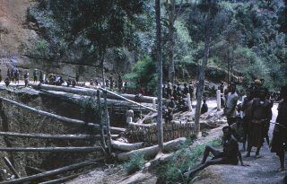

[Click HERE to hear Mrs. Wagner](audio/043-002.mp3)

## BRIDGES - Connecting Roads
Imagine huge logs, about 24 to 30 inches in diameter and 65 to 70 feet
long, being pulled by a hundred or more men.  Several of these huge logs
are pulled to a river, ravine, or gully to make a bridge for the jeep to
cross.

A hole is chopped in the end of the log, much like an eye of a needle; the
vine or root ropes are threaded through this hole and tied.  Root ropes are
cut from a tree that grows in well-watered places.  The roots of this tree
grow just beneath the surface of the ground and quite often are 30 to 40
feet long.  Smaller logs or saplings are used to keep the log moving by
being placed and replaced under the log as it is pulled along the ground.

It is usual to see 100 or more men pulling a log.  All of them make the
occasion of pulling a log a festive one and do everything to make
themselves more handsome and more attractive to the girls who will
watch them.  They put feathers in their hair, paint their noses red, put
tree oil all over their bodies, or smear charcoal on their faces.

They chant and dance as they pull the log.  Their jumping up and down is
timed to coordinate with the cadence of their chant, and at each jump the
log is pulled a few inches.  Much energy is used jumping up and down, but
it is not regarded as wasted.  If the men have to pull a number of logs and
it becomes a bit commonplace, they put less energy into the dancing and
more energy into the pulling.

### Reverend Wagner’s ‘Walkabout’

[Click HERE to hear Mrs. Wagner](audio/045-001.mp3)

## A NEW GUINEAN “WALKABOUT”
To a New Guinean missionary -

> “Walkabout” is a very common term.  It is a rather extensive
> hike of days or several weeks to survey new areas or to make
> arrangements with new communities to be served by native
> evangelists (Mission Newsletter. Let’s talk about a “walkabout” by Reverend Ian Kleinig).

The missionaries reached the Enga, Duna, and Hewa locales throughout
the Highlands, by “Walkabouts,” and to give you an idea of the paths
they followed, and the mountains they climbed,

> Consider this incident of a descent and add a few more ascents
> and descents to it, to visualize a one-day journey.  We were above
> Makare, and the altimeter read 8,000 feet.  At Makare, forty-five
> minutes later, of which the last ten minutes were more or less
> level going, the altimeter read 6,600 feet – a drop of 1,400 feet in
> a little more than half an hour (Wagner Newsletter, pg 3, May 9, 1955).

The first “Walkabout” the Reverend Bill Wagner took was when he and
Mrs. Ruth Wagner first arrived in New Guinea.  Missionaries Hintze and
Strackbein took Reverend Wagner on a “Walkabout” to tour the out-
stations in the Highlands.  They left Yaramanda and were gone for four
(4) days.  When they returned, they left again, three (3) days later, for
another four (4) days.  This time they visited Raiakama, where the
Wagners were to build their station, and witnessed a native reception.

[Click HERE to hear Mrs. Wagner](audio/047-001.mp3)

Word that they were coming had gone ahead of them, and as they came
down the mountain, the “yodeling,” so to speak, of the carriers told them
that they were near.  As they approached the station and were in sight of
it, they noticed that branches had been placed across the road and that
the native teacher, Tomaonec, and Ere, the interpreter, were standing
behind it.

> Our carriers dropped back, and alone, the missionaries walked up to
> the barricade and stopped.  Ere spoke a prayer in Pidgin… (Wagner Newsletter, May 1955).

The branches were symbolically lifted, and they were welcomed into the
valley.  The missionaries shook hands for fifteen (15) minutes, going
from one set of hands to another, along the line.  Shaking hands as a
greeting had been introduced by missionaries and government men and
almost was, by then, an accepted way of greeting your fellow man.
Yaramanda is 5,600 feet above sea level and Raiakama is 6,200 feet.

Since Reverend Wagner’s first “Walkabout”, he undertook many, many
more to get to the people he needed to see throughout his working
career in the Western Highlands of New Guinea.

[Click HERE to hear Mrs. Wagner](audio/049-001.mp3)

==> text/050.txt <==
Leaving New Guinea was a difficult choice for Reverend Bill and Mrs. Ruth
Wagner.  They had spent fourteen years of their life in New Guinea and all
of their children had been born there.  Therefore it was understandable
that they would have mixed feelings about taking up a new life back home
in the United States.
Newly married and full of enthusiasm, they had arrived in March 1955, to
bring the word of Christ to the peoples in the highlands of New Guinea.
What made them more uneasy were stories they had heard about how
much more difficult it was to adjust to life in their homeland than it was to
adjust to life in a foreign land.
But, the Wagner children were growing up and a decision had to be made
about their future.  The Reverend Bill and Mrs. Ruth Wagner were torn
between staying in Enga-land, or doing what was best for their daughters.
As Reverend Wagner struggled with this, he finally came to a decision -
Next
We have weighed the call to New Guinea to serve Engas with the
Word of God and feel that after 14 years to want to serve the Lord
elsewhere is not denouncing His call to serve Engas as a lesser
call but merely a decision to try to do the best we can for our
children, His gifts to us, while at the same time endeavoring to
continue to serve in a new situation.  We do not feel that it is wise
nor expedient to do one task at the expense of another when both
are incumbent upon us [Wagner Newsletter, November 28, 1968].
Returning to the United States

==> text/051.txt <==
Returning to the United States; at the Airport in  Honolulu, Hawaii
Previous

==> text/052.txt <==
The facts were that one teenage daughter was already 3,000 miles away
attending one of the secondary schools in Australia and another daughter
would be going there in two years to also further her education.  The
Wagners realized that this was a difficult task for any child to endure. One
of their daughters was living most of the time away from home and
another would follow.  As parents, Reverend and Mrs. Ruth Wagner
understood the isolation their daughter felt and they did not want to
continue being separated from her or their other daughters for most of the
time.
Next
Cont'd
Our first Christmas there and how it had meant so much to us because
Sarah, our first born, had arrived one month earlier.  But now, Sarah
would be returning home from Luther College in Melbourne [Australia]
to New Guinea for the family’s last Christmas together before going to
America.  [Wagner Newsletter.  1968]
Although their future [at that time] was quite indefinite, the Wagners had
found a new peace in their decision.  Reverend Wagner made inquiries
about studying again before accepting a call into the parish ministry.  In
the meantime, the Wagners would follow God’s guiding hand.  It had been
arranged that another Pastor and his wife would replace them at their last
mission station in Sirunki.  In all, the Wagners were in New Guinea from
1955 at Raiakama, moved to Mambisanda in 1961, and then left Sirunki in
1969, a total of 14 years in New Guinea; a place where the Wagners still
refer to - as home.
In the decision to leave for the USA, Mrs. Ruth Wagner looks back to the
joy of her first memories of being in New Guinea -
The Wagners and their five daughters left New Guinea for the United
States in April of 1969.

==> text/053.txt <==
<http://www.sil.org/pacific/png/maps/SHP_Enga_small.jpg>
Enga Province lies toward the north-western end of the
highlands region while Southern Highlands and Western
Highlands lie south and east respectively.
Previous
Click Map to Enlarge

==> text/054.txt <==
THE WESTERN HIGHLANDS PROVINCE: The Enga People
Where is Enga Province?
Enga Province is one of the five (5) Highland Provinces in New Guinea,
which includes Eastern Highlands, Western Highlands, Chimbu, and
Southern Highlands. Enga lies towards the far north-western end of the
Highlands region in New Guinea.
Enga has five (5) District Regions:
1.Wabag Central District
2.Tsak Wapenamanda District
3.Lagaip Porgera District
4.Kompiam Ambum District
5.Kandep District
The provincial headquarter and the capital is centered in Wabag.
The Enga Province is the highest and most rugged in New Guinea.  It
covers an area of 4942.2 square miles.   Much of the province is at
altitudes of over 6561.7 feet.  Lower altitude areas are typically valleys,
which form the watershed for the two major river systems that drain the
province, the Lagaip [which is a tributary of the Fly] and the Lai [which is
a tributary of the Wahgi] <http://en.wikipedia.org/wiki/Enga_Province>.
Next

==> text/055.txt <==
Enga Sing Sing
Click
 HERE
 to watch film clip
Previous

==> text/056.txt <==
Click HERE to hear Mrs. Wagner
WHO ARE THE PEOPLE OF ENGA PROVINCE? - An Introduction
Next
The traditional Enga settlement style is that of scattered homesteads
dispersed throughout the landscape. Sweet potato is the staple food,
sometimes (not often) supplemented by pork.  Pigs are a culturally valued
item of exchange.  It is the elaborate systems of pig exchange that mark
social life in the province.
In Enga society there is a strict segregation of sexes. Husband and wife do
not share the same household unless the couple has tried to adopt the style
of the Europeans.  In the true Enga culture, the women and girls live in a
woman's house and the males and boys in a man's house.   Husbands and
wives do not walk together; the man always peceding the wife down the
road.  Only the wife takes care of the pigs and gardens the sweet potato.
Her husband hunts, grows the sugarcane, builds houses, and prepares the
mounds for his wife’s, or wives' sweet potato vines.
Who are the Enga people, you ask?  Well, the Enga are the largest linguistic
and cultural group in all of Papua New Guinea.  They live on the western
side of the Hagan Range in clan groups. The Enga people live mostly by
subsistence farming.
After getting settled in Raiakama, the Reverend William and Mrs. Wagner
were ready to begin their work as missionaries with the Enga people of
the Enga Province.

[Click HERE to hear Mrs. Wagner](audio/056-001.mp3)

[Click HERE to hear Mrs. Wagner](audio/056-002.mp3)

==> text/057.txt <==
A Man and Woman in
Ceremonial Dress at a Sing
Sing. Notice the Bird-of-
Paradise Plumes in their
Wigs; this identifies them
both as Enga. The shape of
their wig is also another
identifier.
"Carefully built
wigs are said to provide a
resting place for the spirits,
to enhance one's powers"

[V. Harbutt]. Also, tree-oil
covers the body, and the
color red is a mark of
beauty
Enga men carrying pig for
ceremony
Men make
and tend
the
ground
oven;
women
bring the
food to go
inside
Previous

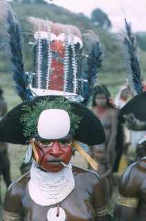

==> text/058.txt <==
Click HERE to hear Mrs. Wagner
Click HERE to view film clip of a pig kill
WARNING : VERY GRAPHIC!
Proud Warriors wearing ceremonial head dresses displaying the brilliant
colors of plumes from the bird of paradise, painted in bright ochre, dance
long into the night to the beat of the kundu hand drums.
Next
The Ceremonial Sing Sing can last for days, during which time many pigs,
the geatest symbol of wealth, will be presented as gifts.  Men will slaughter
the pigs and prepare a feast of pork. The women will bring the bananas,
greens, and mapu [sweet potato] to add to the feast.
But before a feast can begin, preparations will need to take place.  The
men will dig a pit in the ground, and firewood and rocks are placed in the
bottom. When the rocks are heated, layers of vegetables, pork, and greens
are placed in the pit and covered, first with large leaves to protect the
food, and then a layer of insulating dirt is added over the top.
The food will cook for three or more hours, and when it is ready, the dirt
and leaves are carefully removed. The food is then removed from the pit
and guests will use plates of large leaves.  Any leftover food will be sent
home with guests, indicating to all, the wealth and generosity of the host
<http://www.elca.org/countrypackets/png/recipe.html>.
Cont'd

[Click HERE to hear Mrs. Wagner](audio/058-001.mp3)

==> text/059.txt <==
Ta[m]bu: Gate with a spell telling all who approach -
"Do not pass" or "Keep Out"
Previous

==> text/060.txt <==
ENGA CONCEPTS: Overview
[Excerpt from Wagner Newsletter, Sept 24, 1963].
The Enga concepts of life and the world are practical, earthly concepts.
They accept the world, the sun, the moon and the stars as something that
is.  Their concept of a higher power is embodied in the “semongo", or the
spirits of the deceased in their family, in their tribe or among their
kinsmen.  These spirits frequent the places where the deceased lived their
earthly lives, and can cause illness, death, poor crops, etc..
Their fables, which they tell and retell, deal with matters like planting
gardens, gathering of produce from the garden, cooking food, eating food,
or marrying, to name a few.  Another type of spirit enters into these fables;
he is called “putututi” or “kanamongari”.  He can change his form and
become human, an animal, an insect, a bird, or even a tree.  The Enga fear
“putututi” as much as they fear “semongo", as they are both powerful
spirits.
Next
Click HERE to hear Mrs. Wagner
Click HERE to stop audio

[Click HERE to hear Mrs. Wagner](audio/060-001.mp3)

==> text/061.txt <==
Boys from five years of age
and older live in the men’s
house.  Prepubescent boys
wear only a smile
Enga women bring life
into the world out in the
bush, and by
themselves.
The newborn in this
photo is only hours old
Mothers gather together with their children
of both sexes.  When boys are somewhat
self-sufficient, they go to live in their
father's house.  The mother quiets her
baby by stimulating the genitals
Previous

==> text/062.txt <==
Click HERE to hear Mrs. Wagner
Family
The Enga family is a divided family.  Women, babies, all small children
and all girls live in the women’s house.  Men and boys from five to eight
and older all live in the men’s house. A man will build a women’s house
near to the place where he lives in a men’s house and will have his wife
live there, but there is a division which is hard to overcome.
Discipline is very lax, and it is not uncommon for a young lad to sleep in
his uncle’s house because his father wanted him to do a certain thing or
because his father tried to correct him.  However, should a young lad
become a discipline problem for the clan and repeatedly cause strife in
the clan with thefts and misdemeanors, the clan will deal with him and
sometimes deal harshly with him.
Next
Birth
Women give birth to children in a spot removed from the house, a place
overgrown with a considerable growth of wild can bushes and tall
grasses.  If she has difficulty, she can cry for help, someone may come
– it is not uncommon for a woman to have given birth to six or seven
children and have only two reach maturity.  A child is not named at
birth; the parents wait for a month or two to see if the child lives before
naming him/her.

[Click HERE to hear Mrs. Wagner](audio/062-001.mp3)

==> text/063.txt <==
Shields: Warfare is a major aspect of Highland’s life, and shields are the
supreme artistic expression connected with it.  Highland’s shields are
used exclusively for combat and are not related to ceremonial
occasions, as they are in other parts of Melanesia.  During periods of
peace, they were usually stored in their owner’s abode above the fire or
in the Men’s House.  The smoke of the fire blackened and hardened the
timber, so that shields often lasted a century.  Periods of peace were
always unstable, due to ever-changing alliances.  When warfare
inevitable erupted, these stored shields were brought down, repainted,
and used.
Under the Australian colonial rule policy of “Pacification,” which was
initiated in the Highlands from first contact in the 1930s through
Independence in 1975, large scale inter-tribal warfare all but ceased.
Even the smaller skirmishes were largely contained.  Many shields and
other weapons were burned or discarded during this period, but during
the late 1970s, both warfare and shield production began to revive.
Highland’s shields were traditionally stone-adzed, but the introduction
of steel blades has resulted in little alteration in shape, size, or design
Women, babies,
children under 5
years of age -
male and female -
live in the
women’s house,
along with the
pigs. Girls wear
kuta skirts before
they can walk.
Mother and Children in Sweet Potato Garden
Boys stay with their
mother until they are
able to look after
their own needs to a
large extent
Previous

==> text/064.txt <==
Click HERE to hear Mrs. Wagner
Childhood
Children stay with the mother and the mother nurses them for at least
four years before they are weaned.  After the children are weaned, the
boys stay with their mother until they are able to look after their own
needs to a large extent.  The exact age when a young lad leaves his
mother and starts living with his father in the men’s house cannot be
determined.  It varies from about five to eight years of age.
Generally the children are carefree and have little responsibility.  The
father shows the boy how to perform the work of the men and the
mother shows the girl how to do the “women’s work”.  They are asked
to carry firewood, weed the garden and draw drinking water from the
spring.  Children have much time to play.
Next

[Click HERE to hear Mrs. Wagner](audio/064-001.mp3)

[Click HERE to hear Mrs. Wagner](audio/065-001.mp3)

[Click HERE to hear Mrs. Wagner](audio/065-002.mp3)

* * *

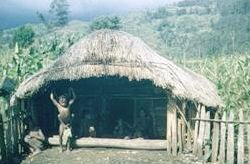

## Houses

The houses the Enga people build serve their need in the climate. The
mountains cause the nights to be cold. They build low houses with solid,
more or less windproof walls and a grass roof.

There is only one door to the house with a kyta or crash door built into the
ceiling to the rear of the house. In the event of a fire, the occupants can
break through this door and out of the house, although it is never used
except in the event of a fire.

The front door to the house is an opening in the wall, and the door is
closed by sliding doubled-over banana leaves back and forth on a pole
which is fastened over the opening. Quite often axe-hewn planks are
placed one by one across the doorway in slots made by two upright posts
to close the opening.

A fire built in the main room of the house heats the house. The smoke
finds its way out through the grass, for there is no chimney. These houses
are very warm, even hot, and the Engas are thus able to sleep warmly
without blankets. Food is cooked on the fire and there are no cooking
utensils.

[Click HERE to hear Mrs. Wagner](audio/066-001.mp3)

## Clan

The clan is concerned with its own existence, and all matters in the clan
reflect this. There are no declared chiefs or rulers in the clan. A clan
matter is usually brought up at the clan meeting place, a place where
also clan ceremonies are held. Everyone is free to speak, but of course
the opinion of the most influential member of the clan will receive support
much more so than the opinion of a “rubbish man” in the clan. So it is
the men with the most pigs, the most ground, the most wives and the
most influence who rule the clan.

The clan at one time carried on warfare with one or another of the
neighboring clans. A sort of dual code arose in this situation. You
could steal from the enemy but you could not ever steal from someone
in your clan. Outside of the clan, nothing was a felony and a particularly
successful crime might even receive the praise of the perpetrator’s
clansmen.

[Click HERE to hear Mrs. Wagner](audio/068-001.mp3)

[Click HERE to hear Mrs. Wagner](audio/069-001.mp3)

## Marriage

In Enga society polygyny was practiced. There wasn't a limit on the
number of wives a man could have, but since there was the custom
of paying a bride price, the number of wives was naturally tied up with what
a man was able to afford.

The marriage proper was carried out in the presence of a sorcerer, or
"topori".

A feast of cooked pig, the payment of the bride price, exchange of gifts
and all having been completed, the “topori” says the proper magic
formulas to ensure a good and fruitful married life.

The taro plant, a plant with large leaves and an edible, starchy, tuberous
root figures largely in the wedding ceremony. A man and his newly
acquired bride will go to a secluded place, and there will sit on the ground
with their legs outstretched, facing each other so that the soles of his feet
touch the soles of her feet. They will then plant a taro between their
outstretched legs at the place where the soles of their feet touch.
They then live happily ever after.

[Click HERE to hear Mrs. Wagner](audio/070-001.mp3)

## Adultery

In former days, a husband would cut off his wife’s nose or the top of her
ear or her fingers, her toes, or the back of her leg. There would often
be fights between clans because of adultery.

The wife of an adulterous man might club the woman who had
committed adultery with her husband.

A change was implemented by the Australian government around 1955.
There is not the same fear for adultery. People serve a jail sentence for
the repercussions of acts of revenge.

[Click HERE to hear Mrs. Wagner](audio/072-001.mp3)

* * *

[Click HERE to hear Mrs. Wagner](audio/073-001.mp3)

* * *

## Death and Grief

Death resides in the house as one of the family, and all are acquainted
with death. Burial of the dead is the general rule. Some, however,
depending on circumstances, were placed in holes or caves in cliffs, or
thrown into a swiftly moving river or sunk in a quagmire.

In burial the deceased is wrapped up to resemble a cocoon. His body is
then suspended between two poles and all gather around to mourn and
wail. To wail for one day is common but some will leave the body
suspended between two poles and wail for two or three days.

As an expression of grief when relative or loved one dies, one joint of a
finger was severed. There are often several deaths within a family. This
expression is practiced by men, women, and sometimes in the state of
grief, the finger joint of a child will be taken.

> “When we left Saka Raiakama (Laiagam) to go home on
> furlough, we must have shaken hands with two thousand (2000)
> people, and oh, how many had lost parts of their fingers.”
> (A note written by Mrs. Ruth Wagner)

Especially in the Highlands, the death wail is also expressed when a killing
frost either harms or kills the sweet potato vines.

[Click HERE to hear Mrs. Wagner](audio/074-001.mp3)

* * *

* * *

## Clothing

The days are warm, and therefore, there is no need for warm
clothing.

The Enga man wears no clothing to cover his body from the waist up,
and walks barefooted. He wears a belt made of string or rope, which
he has made himself. Some have acquired a leather belt to put
around his waist, with the “yabati,” an apron-like woven garment in
the front and a bunch of leaves in the rear. The little boys
approximently 12 years old and under wear nothing but a smile.

The Enga woman wears a two-section skirt or “Kuta” fastened around
her waist covering the front and the rear. The Enga girls also wear
“kuta” skirts, just like their mothers.

The "kuta" is made of reeds which are grown in a small pond much like
the cultivation of rice in Asia.  These reeds are harvested and attached
to a belt.

[Click HERE to hear Mrs. Wagner](audio/076-001.mp3)

* * *

* * *

## Gardens

The economy among the Enga people is largely a subsistence economy.
They plant gardens to supply their needs and since gardens grow all year
long, year after year, they can live off their garden.

Sweet potato, similar to the one we know, is the main food in their diet
and there are over 30 varities. Sugar cane, types of beans, taro,
a spinach-like green, and other greens are also eaten. Europeans
introduced the pumpkin, corn, peanuts, and Irish potatoes to the Enga
diet as well.

[Click HERE to hear Mrs. Wagner](audio/078-001.mp3)

* * *

* * *

## Ceremonial Grounds

Each clan has a meeting place where ceremonies are held. Quite often
near this place there is a sort of sacred grove of trees. Women, girls
or young boys are not allowed to go inside this grove, as this is a place
only for men. In this sacred grove, there is a house, usually inside or
at the base of a tree, where the sacred stones are kept.

The sacred stones are the link between the Enga people and deceased
persons who are now spirits. Each sacred stone is bathed in tree oil,
and painted with natural or trade store color. The Enga seek aid from
the spirits via the stone.

[Click HERE to hear Mrs. Wagner](audio/080-001.mp3)

* * *

* * *

## Trade and Commerce

While the economy is largely subsistence, wealth being connected with
pigs, gardens, etc., there is a kind of money used.

In the Gulf of Papua, off the southern coast of Papua new Guinea, the
shell of a large clam is taken from the coral reefs. This shell is cut and
polished to reveal its golden color. The shell is five or six inches wide.
This shell follows a trade route and has purchase value at each stop.

It would be difficult to determine how a shell found in the Gulf of Papua
reaches the Enga, but it comes to them via a people in the Hagen area
and represents a pig, which means that somewhere a man gave a pig to
obtain the shell. This in then used as money, one shell equalling one pig.
The shell is accepted at face value in paying a bride price, reparations in
the Te Ceremony, obtaining a prized Aga Nut, or Tree Oil, etc.

[Click HERE to hear Mrs. Wagner](audio/082-001.mp3)

The Enga later made money by growing and gathering dry blossoms of
the Pyrethrum plant, then sold them to the Australian government as a
knock-down agent in DDT.   The Australian government and the Mission
introduced other 'cash crops' as well.   Listen Below -

[Click HERE to hear Mrs. Wagner](audio/082-002.mp3)

* * *

* * *

## Skills & Handicrafts

The Enga man is adept with an axe. His axe is used to chop firewood,
build a house, clear a garden and is used for self defense, sometimes war.

[Click HERE to hear Mrs. Wagner](audio/084-001.mp3)

The Enga woman can twist the bark fibers available to her into a small
string for stringing seeds or turn it into a large string for weaving her
net bag. Bark fibers made into string produce bags used to carry
heavy loads. Fibers from the sisal plant, which was introduced from
the coast, produce a finer string for making lighter weight bags and
the men's yambati. Their skills are limited to tasks which are necessary
for them to live, making the Enga people very utilitarian.

Click HERE for film clip

* * *

==> text/085.txt <==
Duna boy has carved comb and
net bag - Hewa man on the [L]
has armband, shell necklace, and
Job's tear body ornaments across
his chest - [R] shows water gourd
in a Hewa man's net bag and a
vine belt around his waist
Hewa man with Cassowary
headdress and bag, vine belt,
arm bands, and other fineries.
Hewa and Enga Men with bow and
arrows; and other mentioned items
Previous

==> text/086.txt <==
The Lutherans in New Guinea
German missionaries of the Neuendettelsau and Rhenish missions
began the work in 1886, entering at two points on the north coast of
what was then the new German colony of East New Guinea. The
inhabitants, Melanesians and Papuans by race, were considered
primitive.  Today in unexplored pockets in the inland mountains, there
still live some of the most primitive people on earth; of all the mission
fields of Asia this is the one where Western civilization has been the
last to come.  The land is mountainous, forested and as might be
expected, thinly populated.  The missionaries faced a tremendous
problem of language.  In 1957, the half a million people populating
the area of the Lutheran church were divided into sixty or eighty
tribes and spoke as many different tongues.  During that time, in a
single church district of 8,000 people four languages are used.  None
of these languages had ever been put into writing.  The missionaries
chose three of the principal languages as “church languages” and
used them and interpreters for their work, adding “pidgin” which is an
adaptation of English.
The story of the development leading up to the remarkable
organization that is the Lutheran Mission New Guinea has a dramatic
history of missionary vision and loyalty, of the bond of faith bringing
aid in the emergencies caused by two world wars, and of the final
union in 1953 of German (Neuendettelsau), Australian (UELCA),  and
the American (ALC, which replaced the Rhenish Mission) missions into
a single internationally staffed and financed (with substantial
subsidies from the LWF) organization.  It was equipped as never
before to carry on in times that was critical for the development of
the New Guinean people and for the church.
3
Click HERE to hear Mrs. Wagner
Cont'd                          Skills & Handicrafts
Bows, arrows, spears, bracelets, holders for the cigarettes they roll,
seeded and feather headdresses,  Sing Sing head dresses with Bird of
Paradise plumes, string belts, water gourds, an instrument similar to a
jew’s harp which is made of bamboo, a flute made from wild cane, and
their clothing are handicrafts enjoyed by many.  The Enga have no art
such as painting or sculpture.
Next

[Click HERE to hear Mrs. Wagner](audio/086-001.mp3)

==> text/087.txt <==
Click
HERE to
hear Mrs.
Wagner
Enga christian wedding; L to R - In yellow
is Kingian, then Rasaka's Bride, Rasaka,
and Dion.  Kingian and Rasaka are brother
and sister.  Dion is their cousin. Reverend
William Wagner presided.  Rasaka became
a full Lutheran pastor, trained at Martin
Luther Seminary in Lae.
Representative of
the Enga People to
the Government-
Late 1960s
Previous

[Click HERE to hear Mrs. Wagner](audio/087-001.mp3)

[Click HERE to hear Mrs. Wagner](audio/087-002.mp3)

==> text/088.txt <==
Click HERE to hear Mrs. Wagner
Change
The impress of Western Civilization which has descended upon this
primitive land out of a clear blue sky as it were, is seen everywhere.
Money - notes and silver - is used everywhere.
Shirts, dresses, trousers, loin cloths, sandals, bicycles, cooking utensils,
plates, spoons and cups are but a few things used.   However, there are
those who embrace Western ideology and more and more will follow
fashion.
Next

[Click HERE to hear Mrs. Wagner](audio/088-001.mp3)

==> text/089.txt <==
Previous
<http://www.sil.org/pacific/png/maps/SHP_Enga_small.jpg>
The Duna and the Hewa are from the Western part of the
Southern Highland Provinces.  The Hewa live in the upper
north-western area, and the Duna live South-West of the Hewa
Click HERE to hear Mrs. Wagner

[Click HERE to hear Mrs. Wagner](audio/089-001.mp3)

==> text/090.txt <==
THE SOUTHERN HIGHLANDS PROVINCE
The Duna and the Hewa People
Reverend Wagner made contact with the Duna by December 1964, and
made exploratory trips into the Hewa Language area during their last
mission circuit in New Guinea before going home to America.
The Duna and the Hewa are from the western part of the Southern
Highlands provinces. The Southern Highlands contains lush, high valleys
sandwiched between towering limestone peaks. The region is 9,189
square miles of remote and relatively undeveloped area.  The province
contains the country's second-highest mountain, Mount Giluwe (14,330
ft). Mendi is the capital town of this mountainous country.
The province is divided into roughly four distinct geographic regions,
but for our purposes, we are only interested in number 1 - The West:
1.The West: Includes the districts of Tari, Koroba, Kopiago and Komo -
the home of the Huli,
Duna, and Hewa peoples
.
The Duna and the Hewa are from the Western part of the
Southern Highland Provinces.  The Hewa live in the upper north-
western area, and the Duna live South-West of the Hewa.  'Click'
Map on previous page to view area.
2.The Centre: Includes the districts of Margaraima, Nipa, Mendi and the
Lai Valley, and is the home of the speakers of dialects of the Anggal
Heneng language.
Next

==> text/091.txt <==
Previous
In 1964, Rev. William Wagner visits the
Duna men at Lake Kopiago.
Upper right photo
shows Duna man with
arm around Rev. William Wagner's Enga
cargo boy [wearing shirt] who helped
carry equipment for walkabout;
Upper Left, and Lower right photo

shows how the Duna men dress. Notice
the straw flowers and wig-rings in their
wigs.  The Duna are the only Highland
people who do this.  The Enga and Hewa
men do not.

==> text/092.txt <==
Click HERE to hear Mrs. Wagner
Cont'd
3.The East:  Includes the districts of Kagua, Ialibu, Pangia and Erave, and
is the home of the speakers of the Imbongu, Kewa, and Wiru languages,
and home to the second highest mountain in New Guinea, Mount Giluwe.
4.The Lowlands: Stretch across the southern part of the Southern
Highlands province from the volcanic peaks of Mount Bosavi to include the
oilfields of Lake Kutubu, and includes the language groups of Biami
[shared with Western Province] Foe, and Fasu. [Excerpt from Wikapedia,
<http://en.wikipedia.org/wiki/Southern_Highlands%2C_Papua_New_Guin
ea>]
The Duna
The Duna Wigmen are proud warriors and have great reverence for birds,
imitating them in ceremonial dances and decorating their wigs with
feathers, flowers and cuscus fur.  Their wigs, like the Enga people, are
woven from human hair, donated by their wives and children.
Strawflowers are especially cultivated for use in their wigs, which is where
the similarity with the Enga stops.  The Duna men also wear wig-rings
made out of seeds that hang from their wigs, and not their ears.  A jingle
can be heard with each step a Duna man takes.
Next

[Click HERE to hear Mrs. Wagner](audio/092-001.mp3)

==> text/093.txt <==
Lake Kopiago;
Duna Men
Reverend William
Wagner met on
Road
Duna Women wearing full
kutas that cover hips
Previous
Click HERE to hear
Mrs. Wagner

[Click HERE to hear Mrs. Wagner](audio/093-001.mp3)

[Click HERE to hear Mrs. Wagner](audio/093-002.mp3)

==> text/094.txt <==
Cont'd
Reverend Wagner, studying the Duna language, was in anticipation of
working with the Duna people, hoping that the Kapyokoo area would be
open to missionaries by July 1963.  This did not happen.
Later in the year, he had gone to a Wabag Lutheran Church [W.L.C.]
conference, which was a body of over 26,000 communicant members who
sent out evangelists and teachers to new areas in New Guinea.  They had
Next
approved the sending of twenty men into the Kapyokoo area
[where the Duna live]..., as soon as it is opened

[Wagner Newsletter, Sept. 24, 1963].
Reverend Wagner continued,

Just recently we were fortunate to be able to find a Duna
speaker to help us prepare for the work in the Kapyokoo area
[Kapyokoo is the Enga word for Kopiago area]… he is able to
speak three languages: Duna, Ipi, and Enga…. However we
found out that his Duna is limited.  We are now working
among the Enga people and are separated from the Duna by
people who speak Ipi… from Enga to Duna it is five days walk
over some very mountainous and timbered country. For
several days the path leads through the Ipi country where
some people make gardens and live.

The last several days of the journey is through timbered
uninhabited country.  Recently, too, we hear “rumors” that
the Kapyokoo area will not be opened until 1964
[Excerpt
from WNL, Rev. William Wagner. Sept 24, 1963].

==> text/095.txt <==
Duna man in front of Reverend
Wagner's house at Lake Kopiago
Previous
Click HERE to hear Mrs. Wagner

[Click HERE to hear Mrs. Wagner](audio/095-001.mp3)

==> text/096.txt <==
Click HERE to hear Mrs. Wagner
Cont'd
In August 1964, Reverend Wagner entered the new area of Lake Kopiago,
the home of the Duna people, and was able to compile a grammar of the
Duna.
Next
“The Duna and the Hewa living in the Kopiago sub-district
number into the 7,000.  In the Wabag sub-district, Engas living in
an area comparable to this are in number about 70,000.  This
means that in reaching the people by hiking one reaches only
about one-tenth as many people per mile of mountain hiked.
Actually it is even less than that because the area settled by the
Engas is very densely populated in fertile valleys separated by
mountains where there are no people.  Duna too live in the many
little valleys by nowhere is there any dense population.  Many
hours and days have been spent on camping trips hiking around
the Kopiago circuit, up mountains, down into river gorges, to
establish the work”
[Excerpt from Wagner Newsletter, June 15,
1965]

[Click HERE to hear Mrs. Wagner](audio/096-001.mp3)

==> text/097.txt <==
Previous
Photo on Left:
Hewa men 1965; ID by hair shape.
Hewa have tall, conical wigs while Enga men have
plain, undecorated wigs; The Duna men wear
strawflowers, feathers, and seeds in their wigs.
Notice Body Ornaments and Seed and Bamboo
Necklaces on the Hewa men
Right photo:
 Hewa man with Cassowary Head
dress [see The Wagner Collection] and Cloak
Click HERE
to hear
Mrs. Wagner

[Click HERE to hear Mrs. Wagner](audio/097-001.mp3)

[Click HERE to hear Mrs. Wagner](audio/097-002.mp3)

==> text/098.txt <==
The Hewa
The word "Hewa" means stranger.
The Hewa extend into two provinces,  Enga and the Southern Highlands
,

and are a remarkably mobile highlands fringe people. They inhabit the area
north and south of the lower Lagaip River in the most northwesterly corner
of Southern Highlands Province, extending from the junction of the Lagaip,
Strickland and Ok Om rivers east into Enga Province to roughly the
Lagaip–Porgera river junction.
Next
An extended family will live in a communal house, on stilts, 14 ft above the
ground.  The large house is also 36 ft. wide and 26 ft. long.  It is made of
split Pandanus logs tied with cane, which has a thatched roof of Pandanus
leaves.  Men and women live in the same house; however, they are in
separate areas.
The Hewa also engage in pig husbandry, and practice low-intensity swidden
[slash and burn] agriculture based primarily on sweet potato cultivation.
In addition to sweet potato, the Hewa cultivate a variety of local and
introduced crops, including taro, banana, sago, pumpkin, cassava,
breadfruit, corn, pawpaw and a number of leafy greens.  They supplement
their diets through hunting, and spear-fishing in the Lagaip River, which is
relied upon more than gardening.
You can recognize Hewa men by their cone-shaped wigs, which are covered
by a net.  Hewa women wear kuta skirts similar to the Enga women, but
Hewa women wear a knitted string head veil with Job's Tear seed and
cowrie shells sewn around the face line.

==> text/099.txt <==
Rev. William Wagner's
interpreter, Etiko
[wearing shirt and lap
lap],  with Hewa men
Handled Bag &
Bamboo
Necklace
Previous
Notice the Armband,
Bamboo & Cowrie Necklaces
Notice Body Ornaments -
Chest/Face Job's Tear seed,
Cowrie Shell and
Bamboo Necklaces -
See Wagner Collection
1965 Lake Kopiago area; Hewa Men
Click HERE to hear
Mrs. Wagner

[Click HERE to hear Mrs. Wagner](audio/099-001.mp3)

==> text/100.txt <==
Rev. William Wagner speculates on exploratory trip into Hewa territory,
Next
“The most recent of the government patrols into the area established
contacted and counted about nine hundred Hewas in four or five days of
hiking.  We want to go into the area soon and bring the word of truth…it
is going to be a difficult task.  Another language, more hiking and hiking
in a different direction, not to mention the fact that there are no Hewas
who speak Pidgin English, the language we use in making our contact.
That means we have to use two interpreters, one to translate the Pidgin
English we speak into the Duna Language and another to translate what
the first interpreter has said in Duna into Hewa.  There are a few Duna
who speak Hewa and we are told that there are a few Hewas on the
perimeter of their area who speak Duna.  Five of the Hewa came into the
Kopiago recently with the government patrol when it returned and they
have now carried word of the outside world back to their people”

[Excerpt from Wagner Newsletter, December 2, 1964].
Cont'd
“In addition to the Duna work, just recently work among the Hewa came
to light. Up until this time the population of the Hewa [was] just
speculation as patrols by the Administration officers [Australian patrol
officers] had failed to contact more than just a handful of the Hewa.  It is
almost unbelievable to think that in the present age of rockets, satellites,
hydrogen and super bombs, with travel a matter of hours between
continents that there should be a portion of this earth untouched by
outsiders where a people live an insular life with no contact with the
world around them.  The Hewa may as well have lived on another planet
and may as well have watched the world go drifting by...
[Wagner Newsletter, December, 1964].
Reverend William Wagner continues,

==> text/101.txt <==
One of the most important forms of Hewa
art is decorated arrows [Eastburn, D. R.,
"The HEWA: People of Papua New Guinea"]
Notice Hewa vines belt - It is made
with strands of cane that have
been woven into a point in the
front - See the Wagner Collection
Previous
1965; Hewa Men
Click HERE
to hear
Mrs.
Wagner

[Click HERE to hear Mrs. Wagner](audio/101-001.mp3)

==> text/102.txt <==
Rev. Wagner, who is living in Kopiago area while researching the Hewa,
writes his wife Ruth, who is still in Sirunki about his exploratory "Walkabout"
Next
The Hewas just ten months ago were an unknown quantity. Their
presence in a prescribed area was known because they had been seen
from airplanes flying over the area, but no personal contact has been
made with them because they lived over the mountains two days’
hiking distance from Lake Kopiago.  What mountains!  We followed the
advice of our guide on one of our trips and we climbed from the Pori
River up and up over the mountains to return to Kopiago.  We climbed
for six hours, always up and up and at the very top we scaled the
limestone cliff, pulling ourselves up with our hands on top of a ledge
and our toes placed in toeholds in the face of the cliff.  The path was
well defined and at no time were we in any danger of falling, but it was
truly a climb.  We estimate that we climbed about 6,000 feet.  The Pori
River as Papapuka is approximately 3.600 feet and the mountain is over
10,000.  We now know the area better and will not climb that mountain
again.  We plan our trip so as to go completely around the mountain
and return on the other side of it.

Just a note. I am just now back from Hewa.  Terrible hiking, 6 hours
up, up, and up.  Must have climbed 4,000 or 5,000 feet up…  The
Hewa are people who live in houses on stilts.  At first because of the
Pidgin English way of speaking, “Haus bilong em i stap antap long
dewai,” our missionaries thought that their houses were built in trees.
Jerry Arndt, [
who replaced Rev. Wagner while he came in for Kristen’s
birth, the Wagner’s fifth daughter],
said that they do live in houses on
stilts, sometimes as high as 14 ft above the ground.
[Wagner
Newsletter, December 2, 1964].
Reverend William Wagner continues,

==> text/103.txt <==
Reverend
William
Wagner's
initial visit
to the Hewa
-
Notice the
box,
newspaper,
and tin can
Previous
Click HERE to hear Mrs. Wagner
Pig Tusks are filed down
before being put through
Septum; Notice the
Bamboo Necklace [see The
Wagner Collection] on
Hewa man standing
behind

[Click HERE to hear Mrs. Wagner](audio/103-001.mp3)

==> text/104.txt <==
Click HERE to hear Mrs. Wagner
In the past ten months we have spent a goodly share of our time
hiking, and have had the misfortune of training three informants
one after the other so that we have not progressed in the
language to the point where we are able to use it capably.  We can
speak Duna only haltingly… all in all it has been a hectic ten
months, so that now the mountains are taller and the miles are
longer and we are ready for furlough”,
[Excerpt Wagner
Newsletter, June 15, 1965].
Next
From the LCMS website
 ~https://www.lcms.org/pages/internal.asp?NavID=4277
In later years, the Hewa people came “within reach” in 1990, when
an airstrip was completed at the Southern Highlands village of Wanakipa.
Cont'd
Indeed, after this excursion, Reverend William Wagner rejoined his wife
and children at Kopiago and then left on furlough July 14, 1965 for six
months – When the Wagners returned from furlough, they continued
their work with the Enga at Sirunki until May of 1969, when it was
decided for the sake of their family to go back to the United States.

[Click HERE to hear Mrs. Wagner](audio/104-001.mp3)

==> text/105.txt <==
2005.08.001
 L 10" x W 1.75"
2005.08.002
 L 10.5" x W 1.25"
Previous
Click HERE to hear Mrs. Wagner

[Click HERE to hear Mrs. Wagner](audio/105-001.mp3)

==> text/106.txt <==
THE WAGNER COLLECTION
Highland Armbands
Southern Highland Provinces, New Guinea, c. 1960
[2] Armband, maker unknown
Accession Number: 2005.08.001
Description: Dry grass, tightly woven.  Two rows of loose grass pieces in
a "V" shape at joining of bands [a frayed area]
Circum. 10", W 1.75"
Accession Number: 2005.08.002
Description:  Rich patina, course plant material, braided. Three
attachments held on by thin grass strands. Attachments are shaped as
claws of unknown source.
Circum. 10.5", W 1.25"
*D.R. Eastburn. The Hewa.  1980. National Cultural Council.
 Armbands are decorative body ornaments
Next

==> text/107.txt <==
2005.08.051
L 21.5" x W 4"
2005.08.054
L 19" x W 2"
Previous
Click HERE to view film clip

==> text/108.txt <==
Highland Axes
The Uaa is the Enga and Duna word for axe.  Early axes were almost
always wood hafted weapons, the heads of which were made of carved
stone chipped to an edge.   As time progressed, metal-hafted and metal-
headed axes became more commonplace. Steel trade store axes have
replaced stone axes in most of New Guinea. Stone was traditionally traded
down from Highland quarries on both sides of the island to the rivers,
swamps and coastal areas where any stone is scarce.  The different stones
have names: Sambi - mottled stone; Morokea - black stone; Kunjina -
black and grey stone [information provided by Kristen Wagner, Mrs. Ruth
Wagner's daughter]
Western Highland Provinces, New Guinea, c. 1960
[2] Hafted Axe, stone, wood, grass fiber, maker unknown
Accession Number:  2005.08.051
Description: Mt. Hagan axe.  Dark brown patina, hafted stone axe. Fine
textured greenish stone with brown mottling.  There are several natural
gouges and pits on each face, plus some chipping on the cutting edge. The
haft is basically finished with brown/black mottled stone showing in two
places on opposite end of axe head.  Handle has beautiful patina, has
mottled wood pattern, and comes to point at the end.
L 21.5", W 4" at widest point, Depth is 1"
Accession Number: 2005.08.054
Description: Enga axe used for war/chopping wood.  This mounted war axe
has a slightly curved, smooth, handle with rich patina.  It is attached to a
shaft holding a black stone axe head, all secured by a plant fiber wrapping.
L. handle 19" , L. axe head 17.25"
Next

==> text/109.txt <==
2005.08.052
 L 22.5" x W 2"
2005.08.053
 L 20.5"
Click HERE

for film clip
Previous

==> text/110.txt <==
Highland Adzes
The Enga and Duna used adzes for work and war weapons. They were
carved of stone and lashed with cane to a wooden handle. The work adze
has a smaller and usually badly worked blade set in the same type of
hafting as the axe.
Western Highland Provinces, New Guinea, c. 1960
[2] Hafted Stone Adze; stone, wood, cane, maker unknown
Accession Number: 2005.08.052
Description:  Duna War Adze.  Curved black stone, fine textured, several
chips on cutting edge.  Stone and handle are tightly wrapped with plant
fiber, light in color.  Handle has patina, is worn, has nicks and cuts.
L 22.5'
Accession Number: 2005.08.053
Description: Mounted work adze with curved, smooth, highly lacquered
handle.  Axe head is tightly woven with lacquered plant strips; striking
end is a smooth, green/blackish stone.  The cutting edge is very sharp
with several chips and a gouge on one side.  The plant fiber is unravelling
on one side
L 20.5", axe head 5.25"
Next

==> text/111.txt <==
2005.08.064
  L 5.25" x 1.75"
2006.02.006
 L 3.75" W 1.75"
2006.02.053
  L 5" x W 2.5" x D 0.5"
2006.02.052
L 4.5" x
W 2.25" x
D 0.5"
2005.08.066
 L 5" x W 2" x D 0.25"
2005.08.063
L 6.5' x W 3"
Previous
2006.02.017
L 2.25" x W 1.75" x D 0.375"
The different stones have names:
Sambi - mottled stone;
Morokea - black stone;
Kunjina - black and grey stone
Information provided by
Kristen Wagner

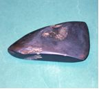

==> text/112.txt <==
Highland Provinces, New Guinea, c. 1950s through 1960s
[7] axe head , stone, maker unknown
Highland Axe Heads
Accession Number:  2005.08.064
Description: Black rectangular-shaped with sharpened edge.  Has many
flecks that are grey in color, and a few black.  L 5.25" x W 1.75"
Accession Number:  2006.02.017
Description:  Black stone, fine textured.  Has several large chips from face
near haft end.  On other side, one large & several small chips.  Cutting
edge has a few nicks.  L 2.25" x W 1.75" x diam. 0.375"
Accession Number: 2005.08.063
Description:  Green with brownish mottling.  L 6.5" x W 3"
Accession Number: 2005.08.066
Description:  Rectangular shape, bevelled to a cutting edge, tan to darker
greyish tip.  L 5" x W 2" x D 0.25"
Accesion Number: 2006.02.053
Description:  Black triangular-shaped carved and polished axe head.
Several gouges in face.  L 5" x W 2.5" x D 0.5"
Accession Number:  2006.02.006
Description:  Greyish-black with brown undertones.  Three gouges on
cutting edge and face.  L 3.75" x W 1.75"
Accession Number: 2006.02.052
Description:  Grey/greenish stone; flaked axe head, chipped throughout
piece.  Highly polished slashed, smooth.  L 4.5" x W 2.25" x D 0.05"
Next

==> text/113.txt <==
2005.08.057
 L 18" x W 60"
2005.08.056
L 26.5" x W 9"
2005.08.055
 L 18" x W 19"
2006.02.030
L 18" x W 25"
2006.02.031
 L 18.5" x W 15.5"
Previous
Click HERE to
hear Mrs. Wagner

[Click HERE to hear Mrs. Wagner](audio/113-001.mp3)

[Click HERE to hear Mrs. Wagner](audio/113-002.mp3)

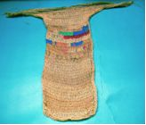

==> text/114.txt <==
Highland Bilums and Bags

Western Highland Provinces, New Guinea, c. 1960
[5] Bilum, 'nuu' or 'madi', plant fiber thread, dye, maker unknown
Accession number: 2005.08.057
Description:  Loosely woven, multicolored net bilum with horizontal striped
motif; handles of two-ply plant fiber string. Colors: fushsia, pink, grey, teal
blue, natural. L 18" x W 60"
Accession number: 2005.08.056
Description:  Tighter woven multicolor utilitarian string bilum.  Colors:
natural, green, blue, and pink. L 26.5" x W 9"
Accession Number:  2005.08.055
Description:  Loosely woven net bag, multicolored with different motifs on
each side; attached handle. Side one colors: red, blue, green, natural.  Side
two colors: orange, blue, natural, green. L 18" x W 19"
Accession Number:  2006.02.030
Description:  Loosely woven net bag, blue background with red and natural
"trees," attached handle 14" long, measured where attached to netting.
L 18" x W 25"
Accession Number:  2006.02.031
Description:  Loosely woven, multicolored net bag with handle; has
horizontal striped motif.  Colors: fuchsia, blue, natural, green on handle
only.  L 18.5" with handle x W 15.5"
Next

==> text/115.txt <==
2006.02.018
 L 55.5" X w 32"
2006.02.019
 L 48" x W 34"
Previous
Click HERE to hear Mrs. Wagner

[Click HERE to hear Mrs. Wagner](audio/115-001.mp3)

==> text/116.txt <==
Next
Highland Turi Mat
Western Highland Provinces, New Guinea, c. 1950
[2] Turi, Pandanus Leaf and thread, maker unknown
The Turi supports the child’s back when the mother is carrying the child in
the net bag wherever she goes. It also provides protection from rain and
the sun, and is used as a sleeping mat.
Accession Number:  2006.02.018
Description:  Light tan rectangular mat made of Pandanus leaves and
rolled plant fiber used as stitching.  Used by Enga women to sit on, as
rain shelter, and to provide support for carrying babies in the bilum.
Increasingly larger mats are made as baby grows.  L 55.5" x W 32"
Accession Number:  2006.02.019
Description:  Light tan rectangular mat made of flattened Pandanus
leaves.  Rolled plant fiber used as stitching. L 48" x W 34"

==> text/117.txt <==
2006.02.003
  L 12"
2006.02.004
  L 12"
Previous
Click HERE to hear Mrs. Wagner
Click HERE to stop audio

[Click HERE to hear Mrs. Wagner](audio/117-001.mp3)

==> text/118.txt <==
Next
Highland Cassowary Bone Digging Sticks
Western Highland Provinces, New Guinea, c. 1950
[2] Digging Stick, Cassowary Leg Bone, maker unknown
When planting sweet potatoes, the Enga woman makes small holes in the
mound with her digging stick, and after poking the vine into it up to her
armpit at times, packs the ground around it.  Enga men use a shorter
version of the Cassowary Bone Digging Stick in their wigs as decoration
during the Sing Sing.
Accession Number:  2006.02.003
Description: Ivory colored femur bone of Cassowary bird;  one end carved
to a point.  L 12"
Accession Number:  2006.02.004
Description: Ivory colored femur bone of Cassowary bird;  one end carved
to a point.  L 12"

==> text/119.txt <==
2006.02.007
L 11"
2006.02.008
  L 10.7" x Circum. 2.8"
2006.02.009
L 21.5" x Circum. 6"
         2005.08.061
L 13.66" x Circum. Big End 9.25" - Mouth 4"
Previous

==> text/120.txt <==
Click
HERE
to hear
Mrs.
Wagner
Western Highland Provinces, New Guinea, c. 1960
Aerophones: [3] Flutes, bamboo; [1] horn, aga bark, leaves, bamboo,
makers unknown
Highland Flutes and Horn
Next
Accession Number: 2006.02.008
Highlands, Papua New Guinea, c 1960
Flute, bamboo, maker unknown.
L 10.7' x Circum. 2.8"
Accession Number:  2006.02.007
Highlands, Papua New Guinea, c 1960
Flute, bamboo, maker unknown.
L 11"
Accession Number: 2006.02.009
Highlands, Papua New Guinea, c 1960
Pan Flute, cane, plant fiber thread, maker unknown.
L 21.5" x Circum 6"
Accession number: 2005.08.061
Western Highlands Provinces, New Guinea, c. 1960
Replaced CONCH shell in certain areas of the Highlands
Horn, Bella, bark strips, leaves, bamboo, maker unknown.
L 13.66" x Circum. Big End 9.25" - Mouth 4"
Mambu: 1. bamboo 2. pipe, tube 3. a flute made out of bamboo ['bamboo'
is also called mambu in Tok Pisin]. Two main types of flutes are played in
New Guinea: the panpipe and single-tube flute [McLean, 1994: 17-24].
Panpipes are widely distributed in the Highlands, but are also found in
many other locales [McLean, 1994: 17-19].
This station in Yaramanda was the home of Missionary Otto Hintze, one
of the first missionaries in the Highlands, who was in charge of this
circuit.
Yaramanda would be the Wagner’s home for the next two months, until
they would continue on to Saka Raiakama to begin a new main station
and a circuit of their own.

 “This little grass house (below) is in Yaramanda, that is the first, that's
where we came to when we came into the Highlands. and a.. Yaramanda
was or is ahh.. a Mission station that was practically the second station
that was ... umm.. started there in the Enga territory.. Otto Hintze was
there, that would have been 1948, 1949, when he was there…so you are
looking out over the valley and the Lai River is there.. This is the gorge
for the Lai River”
“This little grass house (left) is
called ‘Strackman’s House”
and Bill and I lived here before
we went to Saka Raikama.
When we arrived in New
Guinea, we stayed with the
Hintze family.  This picture
was taken at their station in
Yaramanda. We stayed there
with them, ate there, had our
bible study, wonderful
conversations, and
on Sunday, played games. This little grass house is where we slept
because at that time, there were no facilities for other families in theirs.
We just slept there.  The building off to the side is one of Otto's
'Mitianda’  (on the right) It would be where he had church service.”

(Ruth Wagner; slide  video)
[Picture Courtesy of Mrs. Ruth Wagner]
8

[Click HERE to hear Mrs. Wagner](audio/120-001.mp3)

==> text/121.txt <==
2006.02.005
L 28" x Circum. 19" around the drum head
Previous
Click HERE to hear Mrs. Wagner
Click HERE to stop audio
Click HERE to hear Mrs. Wagner
Click HERE to hear Mrs. Wagner

[Click HERE to hear Mrs. Wagner](audio/121-001.mp3)

==> text/122.txt <==
Highland Kundu or Hand Drum
Kundu: a small, wooden, hourglass-shaped hand drum often used in
traditional singing and dancing. The top of the drum is covered with
marsupial skin and adhesives of either tree gum or blood mixed with lime.
Small rounds made of bees wax attached to drum head for different tones
in the sound of the drum.
Western Highland Provinces, New Guinea, c. 1950
[1] Membranophones: “Kundu” or Hand Drum, wood, plant fiber rope,
cloth, tree gum, marsupial skin [drum head], animal fur [Tree Bear], bees
wax, maker unknown.
Accession Number: 2006.02.005
Description:  Unfinished carved wooden drum, light in color, long cylinder
with bell shape on both ends.  Drum is hollow.  Top is covered with Tree
Bear hide secured with cloth-wrapped ring.  Has three little round clumps
of bees wax, and stains where seven more were attached.  Plant twine
wrapped around bottom of ring, ends hanging loose.  Attached to upper
side is strip of Tree Bear fur.  Bottom has carved ring above bell end and
on bell end, there are drawings.  Drum has a few cracks that have been
mended.
L. 28" x Circum. 19" around drum head.
Next

==> text/123.txt <==
2006.02.036
L 14.75" x W 2" at widest end
2006.02.037
L 14.25" x W 1.75" at widest end
Previous
Click HERE to hear Mrs. Wagner

[Click HERE to hear Mrs. Wagner](audio/123-001.mp3)

==> text/124.txt <==
Highland Seed Rattles
Western Highland Provinces, New Guinea, c. 1960
[2] Idiophones: Seed Rattle, Pandanus leaf, seeds, plant fiber thread,
maker unknown
Accession Number:  2006.02.036
Description:  Reddish-brown rectangular leaf, folded in half, filled with
seeds, stitched together with thin strip of plant. Seeds are inside for the
noise effect.  Several creases and tears, lots of patina.
L 14.75" x W 2" at widest end.
Accession Number: 2006.02.037
Description: Rattle made of thick, fibrous Pandanus leaf, reddish in color,
folded in half and stitched; seeds are inside for the noise effect. Several
creases and tears.
L 14.25" x 1.75" at widest end.
Next

==> text/125.txt <==
2006.02.014
L 6.5" [string 2"] x W 1" at widest point
2006.02.015
L 7" x W 0.75 at widest point
Previous
“I have only one image of the New Guinean Jew’s harp made from
bamboo: it is when my father took me with him to Pausa [area in
the Highlands], for the 25th Anniversary of the missionary work in
New Guinea.  My recollection is faint, but I have a vision of a New
Guinean man dressed in his native dress holding the Jew’s harp up
to his lips with one hand, and with the other hand moving the string.
The sound that was produced, as I dimly remember, was that of
musical twangs.”
[Stephanie Wagner, email 04/02/2007]

==> text/126.txt <==
This musical instrument, known as a Jew’s harp or in the Enga tongue,
Olaiole, is made of bamboo and has a holding ribbon made from inner bark
of a tree. Fibers from a fern are wrapped around the end. It is played by
holding it:
Highland Musical Instrument - Olaiole
Accession Number:  2006.02.014
Description: Bamboo, split into two pointed sections tied together with
twine. A twine attached at the top.
L 8.5 " with string, W 1" at widest point
Accession Number:  2006.02.015
Description: Bamboo section, split into two pointed sections, twine
attached at the bottom.
L 7" with string tassel, W 0.75" at widest point
Western Highland Provinces, New Guinea, c. 1960
[2] Olaiole, Jew’s harp or Rinu, bamboo, bark and plant fiber thread,
maker unknown.
“up to the mouth with the bamboo tongue twanged.  To create
a melody, you change the shape of your mouth.  An attached
string is jerked to vibrate the bamboo tongue”

[Stephanie Wagner, email on 04/02/2007]
Next

==> text/127.txt <==
2006.02.002 - L 33"
2006.02.028 - L 33"
2006.02.029 - L 38"
Previous

==> text/128.txt <==
Southern Highland Provinces, New Guinea, c. 1960
[3] Body Ornaments, multi-strand, [Job’s Tear] Coix seeds, plant fiber
thread, maker unknown
Accession Number: 2006.02.029
Description: Coix seed strands, grays and browns.  Eight strands have giri
giri shells attached near the string tie.  L 38”
Accession Number:  2006.02.028
Description: Coix seed strands. Seven strings of seeds on the left, ten on
right, and one through middle.  Seeds are strung on plant fiber string,
grouped in middle with one strand hanging in middle.  L 33”
Accession Number: 2006.02.002
Description: Coix seeds are gray and tan.  Fifteen strands tied together at a
central point.  Seeds are cut at one end, and then another is fitted into the
bottom of the next, continuing to make the length.  L 33"
Highland Body Ornaments
Next

==> text/129.txt <==
2006.02.022
L 19"
2006.02.038
L 18"
2006.02.001
L 28"
2005.08.074
L 15"
2006.02.027
L 22"
Previous
Click
HERE
to hear
Mrs. Wagner

[Click HERE to hear Mrs. Wagner](audio/129-001.mp3)

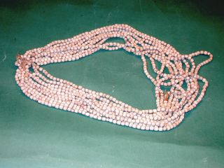

==> text/130.txt <==
Highland Provinces, New Guinea, c. 1950
[5] Necklaces, single & multi strand, maker unknown
Accession Number:  2006.02.038
Description:  Single strand of grey with brownish tinged seeds strung
on plant fiber string.  Few stray pieces of string.  L 18"
Accession Number: 2006.02.022
Description:  Single strand of grey strung on plant fiber string.
String frayed all around necklace.  L 19"
Accession Number:  2006.02.027
Description:  Coix seeds with browns, greys, and reds, tied together
with natural fibers.  L 22"
Accession Number:  2006.02.001
Description:  Braided thick plant fiber string with braided eye and
knot latch.  Tightly butted-together giri giri shells attached with small
diameter string around periphery, stopping 2" from end of knotted side
and 3/4" on 'eye' side. Very heavy, can become twisted quickly.  L 28"
Accession Number:  2005.08.074
Description:  Eight strands of cut grey tan Coix seeds strung on plant
fiber string held together by knots.  L 15"
* For more information see:
DuToit, Brian, Akuna, AA Balkema, 1975 p. 189
Highland Necklaces
Next

==> text/131.txt <==
2005.08.062
L 7.25"
Previous

==> text/132.txt <==
Highland Bracelet
Western Highland Provinces, New Guinea, c. 1960
[1] Bracelet, single strand, Job’s tears Seeds, bark thread, maker unknown
Accession Number:  2005.08.062
Description:  Twenty four grey Coix seeds strung in a row to make circle.
Two grey Coix seeds attached to hang from strand. L 7.25"
* For more information, see DuToit, Brian, Akuna, AA Balkema, 1975 p. 189
Next

==> text/133.txt <==
2006.02.023
L 58"
2006.02.025
L 42.5"
2006.02.024
L 29.5"
2006.02.026
L 22.5"
Previous

==> text/134.txt <==
Highland Bamboo Necklaces
Southern Highland Provinces, New Guinea, c. 1950
[4] Necklaces, bamboo, leaf, maker unknown
Accession Number: 2006.02.023
Description:  Yellow and brown patina on bamboo, cut into 1" - 2" pieces,
strung on a plant stem that has hardened, forming a permanent but
flexible 2-circle necklace.  Ends are tied together.
L 58 “

Accession Number: 2006.02.025
Description:  Yellow and brown bamboo, cut into 1" - 2" pieces strung on
a plant stem that has hardened, forming a permanent, but flexible 2-circle
necklace. Ends are open, have one square of cardboard to keep bamboo
pieces from falling off. L 42.5 “
Accession Number: 2006.02.024
Description:  Brown with patina; pieces cut, hollow bamboo strung on
plant fiber string.  L 29.5”
Accession Number: 2006.02.026
Description:  Yellow, brown bamboo with patina, strung on plant stem
which has been dried firm holding a circular shape.  Bamboo was hollowed
and cut into 1" - 2" sections to make long beads.  L 22.5”
Next

==> text/135.txt <==
2006.02.013
L 14" x W 6"
Previous
Click HERE to hear Mrs. Wagner

[Click HERE to hear Mrs. Wagner](audio/135-001.mp3)

==> text/136.txt <==
Highland Headdress
Hewa Cassowary Headdress:
You can distinguish the Hewa men from the Enga men by the shape of
their wigs.  Hewa men wear a cone-shaped wig that is covered by a net, or
they may don a Cassowary Headdress positioned on the top of the wig as
shown in the photo.
Highlands Provinces, New Guinea, c. 1960
[1] Headdress, Cassowary feather, woven material, hand-made thread,
maker unknown
Accession Number:  2006.02.013
Description:  Cassowary feather
headdress in brown and black colors,
coarse and hair-like as feathers extend
towards the end.
L 14" x W 6"
* May be used in conjunction with beaded
headband shown on the next page.
This headdress is seen in both Enga and
Hewa photographs; Enga men also wear
Cassowary headdresses.
Next

==> text/137.txt <==
2006.02.012
 L 29.5" x W 4.5"
Previous
Click HERE to hear Mrs. Wagner

[Click HERE to hear Mrs. Wagner](audio/137-001.mp3)

==> text/138.txt <==
Highland Shell Headband
In the Enga language, the beaded headband decoration is called “agara
tege”  and both the Enga and Hewa men may wear the headband on their
forehead, below their human hair wigs.
Highland Provinces, New Guinea, c. 1950
[1] Shell Headband, cloth, shells, bark fibers, maker unknown
Accession Number:  2006.02.012
Description:  Woven and braided fiber, wider at the center than at ends,
which has woven strands used to tie the band around the head.  Decorated
with small shells.  L 29.5" x W 4.5"
Next

==> text/139.txt <==
The Lutherans in New Guinea
German missionaries of the Neuendettelsau and Rhenish missions
began the work in 1886, entering at two points on the north coast of
what was then the new German colony of East New Guinea. The
inhabitants, Melanesians and Papuans by race, were considered
primitive.  Today in unexplored pockets in the inland mountains, there
still live some of the most primitive people on earth; of all the mission
fields of Asia this is the one where Western civilization has been the
last to come.  The land is mountainous, forested and as might be
expected, thinly populated.  The missionaries faced a tremendous
problem of language.  In 1957, the half a million people populating
the area of the Lutheran church were divided into sixty or eighty
tribes and spoke as many different tongues.  During that time, in a
single church district of 8,000 people four languages are used.  None
of these languages had ever been put into writing.  The missionaries
chose three of the principal languages as “church languages” and
used them and interpreters for their work, adding “pidgin” which is an
adaptation of English.
The story of the development leading up to the remarkable
organization that is the Lutheran Mission New Guinea has a dramatic
history of missionary vision and loyalty, of the bond of faith bringing
aid in the emergencies caused by two world wars, and of the final
union in 1953 of German (Neuendettelsau), Australian (UELCA),  and
the American (ALC, which replaced the Rhenish Mission) missions into
a single internationally staffed and financed (with substantial
subsidies from the LWF) organization.  It was equipped as never
before to carry on in times that was critical for the development of
the New Guinean people and for the church.
3
2006.02.016
H 3.7" x Diam. 12.2"
Previous
Click HERE to hear Mrs. Wagner

[Click HERE to hear Mrs. Wagner](audio/139-001.mp3)

==> text/140.txt <==
Next
Highland Vine Belt
Hewa men wear the belt around their waist; the belt itself is made of
many strands of vine, which are woven into a point in the front.
Southern Highland Provinces, New Guinea, c. 1950
[1] Belt, Vine, maker unknown
Accession Number:  2006.02.016
Description:  Belt made of coiled vine [pit-pit or cane] with woven
decoration in  front.  Decoration is 3.9" wide and 6.9" high.
H 3.7" x Diam. 12.2"

==> text/141.txt <==
2006.02.032
L 23" x W 18"
2006.02.033
L 22" x W 12"
Previous

==> text/142.txt <==
Next
Highland Provinces, New Guinea, c. 1950
[2] Pig-Killing Apron, or SIK, cloth strip, woven grass string, pig tails,
maker unknown
Accession Number:  2006.02.032
Description:  Apron is tight-woven with 1" horizontal weave next to strand
or braid that hold the pigtails; cloth is doubled and in brown and natural
colors.  L 23" x W 18"
Accession Number:  2006.02.033
Description:  Woven natural color fiber with string strips with numerous
pigtails in browns and black.  Mud is dried onto the pigtails.  L 22" x W 12"
The PNG Highlands is one of the most democratic societies on earth. There
are no chiefs, only big men, who are self-made. As a result, an effective
form of wealth distribution has evolved.  To become and remain a big
man, you must give frequent formal feasts in your community, and feasts
mean pork.  As a sign of his status, the big man host wears a special
woven apron when he kills the pigs at these feasts, and the tails of the
pigs are always added to the apron to increase the prestige of the wearer.
It is not possible to ritually kill the pigs unless you wear an apron, and for
this reason, those who do not own one will rent them for the occasion for
as much as Kina 50, about US$20 per day, which is big money in the
Highlands <http://www.tribalartbrokers.net/details.asp?itemId=SIK>.
Highland Pig-Killing Aprons

==> text/143.txt <==
2006.02.010
L 14' & 24" x W 2" & 9"
2006.02.011
L 15" & 11" x W 40"
2006.02.054
L 16" & 8" x W 25"
2006.02.055
L 16.75" & 12" x W 35"
Previous

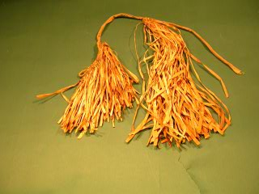

==> text/144.txt <==
Click
HERE
to hear
Mrs.
Wagner
Highland Kuta or Reed Skirt
Western Highland Provinces, New Guinea, c. 1960
[4] Skirts, kuta; Kuni reed, woven grass rope, cloth, maker unknown
[2] Adult, Female; [2] Child, Female
Accession Numer:  2006.02.010
Description:  Light colored kuni grass tied on to plant fiber string cloth
squares; attached over long part of skirt-tie of cloth on plant fiber strings.
L 14" & 24" x W 2" & 9"
Accession Number:  2006.02.011
Description:  Light color tan, female child's kuni grass skirt, attached to
cloth strip; short end of skirt has a loop made of wrapped kuni grass to tie
around waist.  L 15" & 11" x 40"
Next
Accession Number:  2006.02.054
Description:  Light color tan, female
child's kuni grass skirt, attached to cloth
strip; short end of skirt has a loop made
of wrapped kuni grass to tie around waist.
L 16" & 8" x W 25"
Accession Number:  2006.02.055
Description: Light tan grass attached to a
strip of blue cloth; worn by females.
L 16.75" & 12" x W 35"
This station in Yaramanda was the home of Missionary Otto Hintze, one
of the first missionaries in the Highlands, who was in charge of this
circuit.
Yaramanda would be the Wagner’s home for the next two months, until
they would continue on to Saka Raiakama to begin a new main station
and a circuit of their own.

 “This little grass house (below) is in Yaramanda, that is the first, that's
where we came to when we came into the Highlands. and a.. Yaramanda
was or is ahh.. a Mission station that was practically the second station
that was ... umm.. started there in the Enga territory.. Otto Hintze was
there, that would have been 1948, 1949, when he was there…so you are
looking out over the valley and the Lai River is there.. This is the gorge
for the Lai River”
“This little grass house (left) is
called ‘Strackman’s House”
and Bill and I lived here before
we went to Saka Raikama.
When we arrived in New
Guinea, we stayed with the
Hintze family.  This picture
was taken at their station in
Yaramanda. We stayed there
with them, ate there, had our
bible study, wonderful
conversations, and
on Sunday, played games. This little grass house is where we slept
because at that time, there were no facilities for other families in theirs.
We just slept there.  The building off to the side is one of Otto's
'Mitianda’  (on the right) It would be where he had church service.”

(Ruth Wagner; slide  video)
[Picture Courtesy of Mrs. Ruth Wagner]
8

[Click HERE to hear Mrs. Wagner](audio/144-001.mp3)

==> text/145.txt <==
2006.02.056
 H 4" x W 3.5"
Previous

==> text/146.txt <==
Click HERE

for film clip
Shows cane strip around knee
Highland Body Ornament
Southern Highland Provinces, New Guinea, c. 1950
[1] Hewa Body Ornament; Cane Strip, maker unknown
Accession Number:  2006.02.056
Description:  Natural colored coiled bamboo.  Thin strip of cane worn
below kneecap.  H 4" x W 3.5"
Next

==> text/147.txt <==
2005.08.069
L 4.25" x W 2.5"
2005.08.070
L 7.75" x W 3 7/8"
2005.08.071
L 10.25" x W 2 7/8"
2005.08.072
L 10" x 3 3/8"
Previous

==> text/148.txt <==
Highland Hair Combs
The Enga and Duna comb their hair with a pronged bamboo comb.  To
comb, they use upward and forward strokes all around the head.
Highlands, New Guinea, c. 1950
[4] Hair Comb, bamboo, maker unknown.
Accession Number:  2005.08.069
Description:  Brown, plain, carved comb with nine uneven prongs; is worn
in several places.  L 4.25" x W 2.5"
Accession Number:  2005.08.071
Description:  Light brown, maybe
bamboo, or wood carved, incised hair
comb.
L 10.25" x W 2 7/8"
Accession Number:  2005.08.072
Description:  Light color, maybe bamboo
or carved wood hair comb.
L 10" x W 3 3/8"
Accession Number:  2005.08.070
Description:  Brown wood, burn marks
along geometric patterns on top half of
carved comb.  Carved design on top is
partially broken off.  L 7.75" x W 3 7/8"
Next

==> text/149.txt <==
2005.08.073
L 19.75" x Diam. 7.75"
Previous
Click HERE to hear Mrs. Wagner

[Click HERE to hear Mrs. Wagner](audio/149-001.mp3)

==> text/150.txt <==
Highlands, New Guinea, c. 1950
[1] Water container, gourd plant,
maker unknown
Accession Number:  2005.08.073
Description:  Reddish brown, long, smaller
at one end which has been cut off to
make an opening.  Hollow on inside.
L 19.75" x Diam. 7.75"
Highland Water Container
Next

==> text/151.txt <==
2006.02.034
L 5.25" x Diam. 4"
2006.02.035
L 10.6"
Previous

==> text/152.txt <==
Highland Tobacco Pipe
Western Highland Provinces, New Guinea, c. 1960
[2] Tobacco Pipe, bamboo, maker unknown
Accession Number:  2006.02.034
Description:  Tan bamboo piece with geometric designs.  Has a hole in top
for rolled tobacco leaf and "finger" indentations below hole.  End near
hole is sealed naturally.  Mouth end has small holes to receive smoke; is
blackened with tar/nicotine.  L 5.25" x Diam. 4"
Accession Number:  2006.02.035
Description:  Bamboo length closed
at one end, open at other, and is
hollowed out.  Pipe has hole at top
for rolled tobacco leaf and etched in
decoration throughout, simple line
designs; also has burn marks.
L 10.6"
Next

==> text/153.txt <==
2005.08.067
10" x Diam. 1.25"
2005.08.068
L 10.5" x Diam. 1.5"
Previous

==> text/154.txt <==
Highland Cigarette Holder
Western Highland Provinces, New Guinea, c. 1960
[2] Cigarette Holders, bamboo, maker unknown
Accession Number:  2005.08.067
Description:  Rich brown patina, slender, long, made from small branch,
hollowed out point at one end with small hole in shaft; another hole on
opposite end.  Object is hollow.  L 10" x Diam. 1.25"
Accession Number:  2005.08.068
Description:  Rich brown patina,
slender, long, made from small
branch; one hole runs length of
branch; several small cracks or
splits from one end.
L 10.5" x Diam. 1.5"
Next

==> text/155.txt <==
2006.02.020a
H 4" x W 6" x Depth 3.5"
2006.020.021
H 4.25" x W 5.25' x Depth 1" -
Bowl x Diam. 5" - Base
2006.02.020b
H 3" x W 2.5" x Diam. 7.5"
2006.02.047
L 4.75" x Diam. 4.75" & 5"
at each end
Previous

==> text/156.txt <==
Click HERE to hear
 Mrs. Wagner
Carved stone objects – Mortars and pestles are found buried in Highland’s
agricultural plots.  The stone mortars are often knobbed or ridged around
the side and rim and the pestles and pounders are often simple.  They are
believed to be at least 3,000 years old and suggest a society of seed
grinders, although this practice has not taken place in the region within
living memory.  The mortars are used in magic rituals and are treated as
objects of power [http://www.tribalarts.com/feature/highlands/index.html].
Western Highland Provinces, New Guinea, c. unknown
[2] Mortar, stone, maker unknown
[2] Pestle, stone, maker unknown
Highland Mortar and Pestle
Accession Number:  2006.02.020.a
Description:  Grey/brown stone mortar bowl with red stripes cutting
horizontally inside and outside bowl.  Rim has a large chip and base is
uneven.  H 4" x W 6" x Depth 3.5" x Diam. 19.25' - Opening
Accession Number:  2006.02.020b
Description:  Rough, unpolished carved stone; shape is like lop-sided bell.
Narrower and rounded at top to fit in palm of hand, base is also rounded
but larger in size.  H 3" x W 2.5" x Diam. 7.5"
Accession Number:  2006.02.021
Description:   Grey porous stone; lip broken in places, coming out of
fluted rim.  Narrower body, larger base.  Looks like a volacanic rock.
H 4.25" x W 5.25" x Depth 1" - Bowl x Diam. 5" - Base
Accession Number:  2006.02.047
Description:  Dark, porous, stone, rough and unpolished.  It is carved into
a cylindar shape.  L 4.75" x Diam. 4.75" & 5" at each end
Next

[Click HERE to hear Mrs. Wagner](audio/156-001.mp3)

==> text/157.txt <==
2006.02.049
Diam. 6.5"
2006.02.050
L 2.25" x W 2.5" at widest
2006.02.051
L 3" nubs 1" x W 1.75"
2005.08.065
L 3.25" x W 2"
Previous
Click HERE to hear Mrs. Wagner

[Click HERE to hear Mrs. Wagner](audio/157-001.mp3)

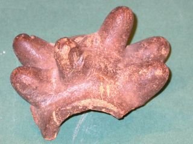

==> text/158.txt <==
Stone War Club weapons were used by only a very few groups in New
Guinea. There were ball, disc, star and pineapple shaped club heads. When
not in use, the clubs were tucked into the back of belts, ready to be pulled
out in an instant to club a person down
[http://www.art-pacific.com/artifacts/nuguinea/weapons/axesclub.htm].
Western Highland Provinces, New Guinea, c. 1950
[1] Club Weapon [3] Club Weapon Fragments, stone, paint, maker unknown
Accession Number:  2006.02.049
Description:  Grey flecked stone, carved in circular shape with 1" diameter
hole in middle.  Has several chips around outside circumference.
Diam. 6.5"
Accession Number:  2006.02.050
Description:  Fragment; reddish carved stone fragment of larger circular
piece used in war.  Has crack around top and through 'toes' of piece.
L 2.25" x W 2.5" at widest
Accession Number:  2006.02.051
Description:  Fragment; very dark brown/black stone fragment with six
nubs [1" each] protruding from circular shape base.
L 3" nubs 1" x W 1.75"
Accession Number:  2005.08.065
Description:  Fragment; pitted stone with bright pink lines; half circle in
shape with four [4] protrusions on each side and smaller 'used to be" circle
towards bottom where it may have been attached to a handle.
L 3.25" x W 2"
Highland War Club Stones
Next

==> text/159.txt <==
2006.02.039
L 53" x W 9.5"
Previous
Click HERE to hear Mrs. Wagner

[Click HERE to hear Mrs. Wagner](audio/159-001.mp3)

==> text/160.txt <==
Warfare is a major aspect of Highland life, and shields are the supreme
artistic expression connected with it.  Highland shields are used
exclusively for combat and are not related to ceremonial occasions as
they are in other parts of Melanesia.  During periods of peace they were
usually stored in their owner’s abode above the fire, like this shield.  The
smoke of the fire blackened and hardened the timber so that shields
often lasted a century.  Periods of peace were always unstable due to
ever-changing alliances.  When warfare inevitably erupted, these stored
shields were brought down, repainted, and used.
Highland War Shield
Next
Under the Australian colonial rule policy of “Pacification,” which was
initiated in the Highlands from first contact in the 1930s through
Independence in 1975, large scale inter-tribal warfare all but ceased.
Even the smaller skirmishes were largely contained.  Many shields and
other weapons were burned or discarded during this period, but during
the late 1970s both warfare and shield production began to revive.
Highland shields were traditionally stone-adzed, but the introduction of
steel blades has resulted in little alteration in shape, size, or design
[http://www.tribalarts.com/feature/highlands/index.html].
Western Highland Provinces, New Guinea, c. 1950
[1] War Shield, wood, decoration undetected, soot encrusted, maker
unknown
Accession Number:  2006.02.039
Description:   Slender wood shield.  Front is one thin piece of wood; back
is a series of split sticks all set against each other with one long
horizontal piece of wood split in half, going down the middle.
L 53" x W 9.5"

==> text/161.txt <==
2006.02.040
L78"
2006.02.041
L 93"
2006.02.042
L 146.5"
2006.02.046
L 38"
2006.02.43
L 148"
2006.02.044
L 88.5"
2006.02.045
L 100"
Previous
Click
HERE
to hear
Mrs.Wagner

[Click HERE to hear Mrs. Wagner](audio/161-001.mp3)

==> text/162.txt <==
Western Highland Provinces, New Guinea, c. 1950
[6] Spear, Palm wood, maker unknown
[1] Uknown; Possible Atl-Atl, wood, maker unknown
Highland Spears
This artifact was packed with the Spears.  Looks are similar to a
cane; it is short, carved, and appears to be separate pieces set into
each other, but on further inspection, is a solid piece.  Decorations
are "xxxx' etchings.  Could not identify - So if you recognize this
piece, please send information through the “Contact Us”
page located in "HOME" on top menu.   Thank you!
Accession Number:  2006.02.040
Description: Medium to dark brown wooden spear.  L 78"
Accession Number:  2006.02.041
Description:  Medium to dark brown wooden spear.  Cassowary claw point.
L 93"
Accession Number:  2006.02.042
Description:  Wooden spear, medium to dark brown in color.  L 146.5"
Accession Number:  2006.02.043
Description:  Medium to dark brown wooden spear.  L 148"
Accession Number:  2006.02.044
Description:  Medium to dark wooden spear.  L 88.5"
Accession Number:  2006.02.045
Description:  Medium to dark brown wooden spear.  L 100"
Accession number:  2006.02.046
Description:
Unknown Object
; Reddish brown wood with etchings/
carvings down the shaft.  L 38"
 We Need Your Help -
Next

==> text/163.txt <==
2006.02.048a
L 22"
2006.02.048b
L 65.5"
Previous

==> text/164.txt <==
Highland Bow and Bowstring
A New Guinea bow is made from the heart of the black palm tree which
has both strength and flexibility. The height is approximately 6 feet or 2
meters. Bamboo is used for the bow string. The bamboo is unstrung at
one end for storage. Smaller bows are used for birds and small game.
Western Highland Provinces, New Guinea, c. 1950
[1] Bow; Enga, wood, cloth, maker unknown
[1] Bow String; bamboo,  maker unknown
Accession Number:  2006.02.048a
Derscription:  Dark colored carved wood with a natural fiber coiled
around the shaft.  L 22"
The New Guinea bowstring is a flat strip of the skin of bamboo knotted at
each end and shaved to under a 1/2 inch in width and hundredths of an
inch in thickness. The flat end of the arrow shaft is held on the inner side
of it. The skin side of the strip is towards the archer.
[http://www.tribalarts.com/feature/arrows/index.html]
Accession Number:  2006.02.048b
Description:  Brown bamboo strip knotted at one end.  L 65.5"
Next

==> text/165.txt <==
2005.08.048
L 38.25"
2005.08.049
L 37.25"
Previous

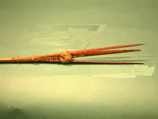

==> text/166.txt <==
Highland Three-Pronged Tip Arrows
The lashed three-pronged tip arrow from the Western Highlands of Papua
New Guinea or from a linguistically related people to the north in the
Schrader or Bismarck Ranges of southern Madang Province.  This is an
example of a hunting arrow found throughout New Guinea that is used for
hunting birds, small tree-dwelling marsupials or, in river-let and coastal
areas, also for fishing.  It has three lightly barbed palm wood prongs
bound to a reed shaft.
<p.257. http://www.austmus.gov.au/pdf/publications/326_complete.pdf>
Western Highland Provinces, New Guinea, c. 1950
[2] Three-Pronged Arrows, m
aker unknown
Accession Number:  2005.08.048
Description:  Brown color bamboo shaft with nice patina and carved,
barbed, 3-pronged point.  The three points run along the outside of the
shaft, with shaft end having carved notch sticking out through middle.
Shaft and prongs are held in place by wrapped plant fiber.  L 38.25"
Accession Number:  2005.08.049
Description:  Brown bamboo shaft hollowed at one end for attachment of
carved wood point with 3-pronged barbs, all secured with braided and
wrapped plant fiber that is covered with brown/black tac.  Shaft has few
cracks at distal end.  L 37.25"
Next

==> text/167.txt <==
2005.08.017
L 38.25"
2005.08.050
L  31.25"
2005.08.041
L 38"
Previous

==> text/168.txt <==
Tri-composite Arrows are used for display, or for fighting special warriors.
Those with human bones are for use against a specific person, a clan
leader or for use in a payback killing for a clan warrior killed in battle.
These arrow types are not present in all highlands areas
<http://www.austmus.gov.au/pdf/publications/326_complete.pdf>.
Southern Highland Provinces, New Guinea, c. 1950
[3] Bone Head Arrows, wood, bamboo, bone, plant fiber, pigments, paints,
maker unknown
Accession Number:

 2005.08.017
Description:  Light colored bamboo shaft, hollowed at end to fit carved
wood fore-shaft, secured with band of braided plant fiber.  Point is carved
all the way down, has bone head attached by more braided plant fiber in a
band.  Shaft has several cracks at end.  L 38.25"
Accession Number:

 2005.08.041
Description:  Bamboo shaft, rich patina, hollowed to fit carved wood fore-
shaft that is attached to shaft with plant fiber.  Narrow bone head connects
to fore-shaft, secured with plant string and covered with dried substance to
hold in place.  Large crack starting at point of attachment down shaft to
first bamboo notch.  L 38"
Accession Number:

 2005.08.050
Description:  Several shades of brown, bamboo shaft, wood fore-shaft
connected by plant leaf fiber, wooden section of arrow is carved with red
and white alternating color.  Pointed head of arrow is sharpened human
bone connected to wooden section by plant leaf fiber.  L 31.25"
Highland Tri-Composite Bone Head Arrows
Next

==> text/169.txt <==
2005.08.003
L 37.5
2005.08.004
L 38"
2005.08.006
L 38"
2005.08.005
L 38.25"
Previous

==> text/170.txt <==
Accession Number:  2005.08.003
Description:  Light colored bamboo shaft, hollowed at end to fit carved
wood pointed head, secured with band of braided plant fiber.  Head has
carved lines towards base colored with red ochre and natural clays.  A small
crack on bamboo shaft by plant fiber band, rough distal end.   L 37.5"
Highland Decorated Arrows
Pointed wooden head decorated with carved design, frequently filled in or
painted with natural clays and ochres and used for display at weddings,
pig feasts and other ceremonies
<p. 257. http://www.austmus.gov.au/pdf/publications/326_complete.pdf>
Southern Highland Provinces, New Guinea, c. 1950
[4] Pointed Head Arrows, decorated with incised design, maker unknown
Accession Number:  2005.08.004
Description:  Light colored bamboo shaft hollowed at end to fit carved
wood pointed head, secured with band of braided plant fiber.  Head has
decor of red ochre and natural clay lines at base.  L 38"
Accession Number:  2005.08.005
Description:  Light colored bamboo shaft with hollowed end to fit carved
wood pointed head, secured by braided band of plant fiber.  Head has two
[2] bands of carvings in red ochre and natural clays.  There are several
cracks at distal end of arrow.  L 38.25"
Accession Number:  2005.08.006
Description:  Light colored bamboo shaft, hollowed at end to fit carved
wood pointed head, secured with band of braided plant fiber.  Decor on
head in red ochre and natural clays near base with plant fiber band.  Shaft
has large crack below fiber band and a rough end.  L 38"
Next

==> text/171.txt <==
2005.08.009
L 38.25
2005.08.008
L 38.25"
2005.08.010
L 38"
2005.08.007
L 38.25"
Previous

==> text/172.txt <==
Cont'd                     Highland Decorated Arrows
Southern Highland Provinces, New Guinea, c. 1950
[4] Pointed Head Arrows, decorated with color and incised design,
maker unknown
Accession Number:  2005.08.007
Description:  Light colored bamboo shaft with hollowed end to fit wood
pointed head, secured with band of braided plant fiber.  Head has carved
bands painted with red ochre and natural clays.  L 38.25"
Accession Number:  2005.08.008
Description:  Light colored bamboo shaft, hollowed at end to fit carved
wood pointed head, secured together by braided plant fiber.  Head has
several incised lines down by plant fiber band that are highlighted in red
ochre and natural clays.  Small cracks and pit in bamboo.  L 38.25"
Accession Number:  2005.08.009
Description:  Light colored bamboo shaft, hollowed at end to fit carved
wood pointed head, secured together by braided plant fiber.  Head has
small band of lines in red ochre and natural clays near base of point.  Shaft
has small cracks near point of attachment below plant fiber band.  L 38.25"
Accession Number:  2005.08.010
Description:   Light colored bamboo shaft, hollowed at end to fit carved
wood pointed head, secured together by braided plant fiber.  Head is
decorated with carved bands; towards tip are four [4] lines in red ochre
and natural clays.  Distal end has larger band has same colors, incised
lines, bar with notches. L 38"
Next

==> text/173.txt <==
2005.08.012
L 36.5"
2005.08.013
L 43"
2005.08.014
L 38.25"
2005.08.011
L 37.25"
Previous

==> text/174.txt <==
Cont'd                          Highland Decorated Arrows
Southern Highland Provinces, New Guinea, c. 1950
[4] Pointed Head Arrows, decorated with color and incised design,
maker unknown
Accession Number:  2005.08.011
Description:  Light colored bamboo shaft hollowed at end to fit pointed
head secured with band of plant fiber.  Pointed head decoration in red
ochre and natural clays.  Has two [2] long cracks in shaft below braided
plant fiber band, more cracks toward distal end. L 37.25"
Accession Number:  2005.08.012
Description:  Light colored bamboo shaft hollowed at end to fit carved,
decorated, wood pointed head that has small carvings in red ochre and
natural clays.  Both are secured together with braided plant fiber, and end
is wrapped and secured with dark tac.  Tip of head is broken off.  L 36.5"
Accession Number:  2005.08.013
Description:  Light brown bamboo shaft, dark brown pointed head, carved
lines at two [2] places.  Lower set of lines incised with red color.  Woven
plant material that connects shaft to pointed head is light colored.  L 43"
Accession Number:  2005.08.014
Description:  Light colored bamboo with hollowed end to fit carved wood
pointed head, secured with braided plant fiber band.  Pointed head has
heavy carvings at base colored with red ochre and natural clays.  Two [2]
cracks down shaft where point attaches.  L 38.25"
Next

==> text/175.txt <==
2005.08.033
L 43"
2005.08.034
l 37.25"
2005.08.035
l 37.25"
2005.08.031
L 37"
Previous

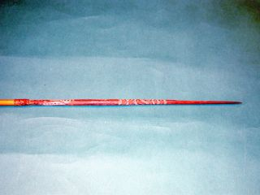

==> text/176.txt <==
Cont'd                       Highland Decorated Arrows
Southern Highland Provinces, New Guinea, c. 1950
[4]  Pointed Head Arrows, decorated with color and incised design,
maker unknown
Accession Number:  2005.08.031
Description:  Light colored bamboo shaft, darker brown pointed head with
carvings at base that are incised in red color.  Shaft and pointed head are
held by a band of woven plant fiber.  L 37"
Accession Number:  2005.08.033
Description:  Light colored bamboo shaft hollowed at end to hold carved
wood pointed head, secured with band of braided plant fiber.  Pointed head
has two [2] sets of carvings - three [3] lines near base, two [2] lines at
other end.  Shaft has large crack near point of attachment below fiber
band.  L 43"
Accession Number:  2005.08.034
Description:  Light colored bamboo shaft with ornamentally carved wood
pointed head, held by braided plant material.  L 37.25"
Accession Number:  2005.08.035
Description:  Light colored bamboo shaft hollowed at end to hold carved,
decorated, wood pointed head.  Decorations are outlined in red color and
natural clays.  Shaft and pointed head are secured with plant fiber.  There
are two [2] cracks coming from point attachment.  L 37.25"
Next

==> text/177.txt <==
2005.08.038
L 38.25"
2005.08.039
L 38"
2005.08.040
L 38 7/8"
2005.08.036
L 38.25"
Previous

==> text/178.txt <==
Cont'd                    Highland Decorated Arrows
Southern Highland Provinces, New Guinea, c. 1950
[4] Pointed Head Arrows, decorated with color and incised design,
maker unknown
Accession Number:  2005.08.036
Description:  Light colored bamboo shaft hollowed at end to hold carved
wood pointed head, secured with braided plant material.  Designs on
pointed head are in red ochre and natural clays.  Short crack near bottom
of braided band where point inserts into shaft.  L 38.25"
Accession Number:  2005.08.038
Description:  Light colored bamboo shaft, hollowed and fitted with a
carved and decorated, wooden pointed head.  Pointed head has carving
throughout its length, colored with red ochre and natural clays.  Both shaft
and pointed head are secured with plant fiber braiding.  Lower part of
braiding has been attached to shaft with a dark tac.  L 38.25"
Accession Number:  2005.08.039
Description:  Light colored bamboo shaft hollowed at end for carved,
decorated, wood pointed head.  Both parts held together with braided
plant material.  Shaft has lengthy split where point is attached.  L 38"
Accession Number:  2005.08.040
Description:  Light colored bamboo shaft hollowed at end to fit carved,
decorated, wood pointed head.  Additional carved decorations in red ochre
and natural clays at attachment point.  Several splits radiating down shaft
from point of attachment.  L 38 7/8"
Next

==> text/179.txt <==
2005.08.022
L 38.25"
2005.08.023
L 38.25"
2005.08.024
L 38.5"
2005.08.028
L 42"
Previous

==> text/180.txt <==
Highland Undecorated Arrows
Common fighting arrows, common to all highland areas.  Each arrow is
composite in structure with two [2] component parts; a shaft into one end,
of which a head is socket-hafted and bound.
<http://www.austmus.gov.au/pdf/publications/326_complete.pdf>
Southern Highland Provinces, New Guinea, c. 1950
[4] Pointed Head Arrows, undecorated, maker unknown
Accession Number:  2005.08.022
Description:  Light colored bamboo shaft attached to light colored carved
wood pointed head.  Held together with braided plant fiber.  L 38.25"
Accession Number:  2005.08.023
Description:  Light colored bamboo shaft, hollowed at one end where
carved pointed piece of wood is inserted.  Plant fiber holds the two [2]
pieces together.  There is a long slit down shaft side where point attaches.
L 38.25"
Accession Number:  2005.08.024
Description:  Light brown bamboo shaft and head, carved wood pointed
head, and both are attached by tied brown plant fiber.
Accession Number: 2005.08.028
Description:  Brown, plain, bamboo shaft, carved wood pointed head,
attached by plant leaf fiber.  L 42"
Next

==> text/181.txt <==
2005.08.029
L 38.25"
2005.08.030
L 38"
2005.08.037
L 38"
Previous

==> text/182.txt <==
Cont'd                       Highland Undecorated Arrows
Southern Highland Provinces, New Guinea, c. 1950
[3] Pointed Head Arrows, undecorated, maker unknown
Accession Number:  2005.08.029
Description:  Light brown shaft, bamboo, attached to wood pointed head;
multicolored browns, carved to pointed head.  L 38.25"
Accession Number:  2005.08.030
Description:  Light colored bamboo shaft hollowed at one end where
carved wood pointed head is placed.  The two [2] parts are secured with
plant fiber which is covered wiith a semi-tacky dark color waxy
substance.  L 38"
Accession Number:  2005.08.037
Description:  Cocoa brown bamboo shaft hollowed at one end to hold
carved wood pointed head and secured together with braided plant fiber.
Long split along shaft by the head attachment.  L 38"
Next

==> text/183.txt <==
2005.08.015
L 32.25"
2005.08.016
L  38.25"
Previous

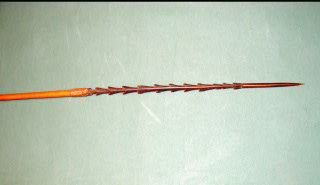

==> text/184.txt <==
Highland Barbed Arrows
Cassowary Claw
Used for display or for fighting special warriors
<http://www.austmus.gov.au/pdf/publications/326_complete.pdf>.
Southern Highland Provinces, New Guinea, c. 1950
[2] Cassowary Claw Arrows, maker unknown
Accession Number:  2005.08.015
Description:  Light colored bamboo shaft with hollowed end to fit carved
fore-shaft, secured by band of braided plant fiber.  Fore-shaft has ten [10]
notches on both sides with one broken off.  Attached to fore-shaft is
Cassowary toenail head.  Several cracks radiating down shaft at point of
attachment, down body, and around end.  L 32.25"
Accession Number:

2005.08.016
Description:  Light colored bamboo shaft hollowed at end to hold carved
wood fore-shaft, secured by band of braided plant fiber. Fore-shaft has six
[6] rectangular carvings removed; on tip of fore-shaft, a Cassowary toenail
has been added. Several cracks at distal end of shaft.  L 38.25"
Next

==> text/185.txt <==
2005.08.021
L 38"
2005.08.025
L 38.25"
2005.08.026
L 38"
2005.08.027
L 38.25"
Previous

==> text/186.txt <==
Cont'd                         Highlands Undecorated Arrows
Used in long-range shooting.
[http://www.tribalarts.com/feature/arrows/plate_4.html]
Eastern Highland Provinces, New Guinea, c. 1950
[4] Straight Undecorated Arrows, maker unknown
Accession Number:  2005.08.021
Description: Light bamboo shaft, hollowed out at one end where a short
carved wood piece is inserted.  The pieces are held together with braided
plant material.  Shaft has small crack where point gets inserted.  L 38"
Accession Number:  2005.08.025
Description:  Light brown bamboo shaft, darker brown carved wood
graduates to a tip; both shaft and tip are connected with plant fiber.
L 38.25"
Accession Number:  2005.08.026
Description:  Multi-browns, slender, long, wrapped leaf string connecting
bamboo shaft and wood point together.  L 38"
Accession Number:  2005.08.027
Description:  Shaft, bamboo, light in color; gnarled wood tip is carved to a
point.  Shaft and tip connect with plant fiber string.  L 38.25"
Next

==> text/187.txt <==
2005.08.044
L 37.75"
2005.08.045
L 38.25"
2005.08.047
L 32"
Previous

==> text/188.txt <==
Highland Lanceolate Arrows
Basic arrow type common to all highland areas.  Has a wide, lanceolate
bamboo head, with a sharp point, and is used for pig killing.
<http://www.austmus.gov.au/pdf/publications/326_complete.pdf>.
Highlands, New Guinea, c. 1950
[3] Lanceolate Arrows, maker unknown
Accession Number:  2005.08.044
Description:  Brown bamboo shaft, hollowed at one end for insertion of a
shorter, darker brown, carved, decorated wood point. Point is broad and
has a slit.  The sections are secured together with a band of braided
plant fiber.  Blade point decorations are four [4] faded reddish vertical
lines and red line sections running.  L 37.75"
Accession Number:  2005.08.045
Description:  Light colored bamboo shaft, hollowed at end to fit carved
wood point, secured by band of braided plant fiber.  It is wide at bottom
and narrow at top.  Red highlighting at fiber band.  Several cracks at end
of shaft and at point of attachment.  L 38.25"
Accession Number:  2005.08.047
Description:  Medium brown bamboo shaft with nice patina, hollowed at
one end to fit a broad point.  Sections are secured together with braided
plant fiber.  Cracks cover entire shaft.  L 32"
Next

==> text/189.txt <==
2005.08.018
L 37.75"
2005.08.019
L 38"
2005.08.020
L 36.25"
2005.08.032
L 37.75"
Previous

==> text/190.txt <==
Common fighting arrow.  The head is teardrop shaped in cross section.
<http://www.tribalarts.com/feature/arrows/plate_4.html>
Accession Number: 2005.08.018
Description: Light colored bamboo shaft, hollowed at end to fit carved wood
point, secured with braided band of plant fiber that is covered in white
specks.  Point has four [4] notches removed from one side. Outlines are in
red ochre.  Tip of point partially broken and shaft has long crack along point
of attachment.  L 37.75"
Accession Number:  2005.08.019
Description:  Light colored bamboo shaft with hollowed end to fit point,
secured by band of braided plant fiber.  Point has eight [8] notches carved
out of one side. They are painted red.  Several cracks are along bottom of
shaft.  L 38"
Accession Number:  2005.08.020
Description:  Light colored bamboo shaft with hollowed end to fit point,
secured with a band of braided plant fiber.  Point has seven [7] notches
carved out on one side and is painted red.  Several small cracks along shaft
near point of attachment; a piece of side is missing at bottom of shaft.
L 36.25"
Accession Number:  2005.08.032
Description:  Bamboo shaft is medium brown, hollowed at end to fit point,
secured by band of woven fiber.  Point has six [6] notches carved on one
side.  L 37.75"
Highland Barbed Arrows
Highlands, New Guinea, c. 1950
[4] Barbed Fighting Arrows
Next

==> text/191.txt <==
2005.08.042
L 38"
2005.08.046
L 31.5"
Previous

==> text/192.txt <==
Cont'd                        Highland Barbed Arrows
Highlands, New Guinea, c. 1950
[2] Barbed Fighting Arrows, maker unknown
Accession Number:  2005.08.042
Description:  Light colored bamboo shaft with hollowed end to fit carved
wood point, secured with band of woven plant fiber.  Larger plant fiber
wraps this and is covered with tac.  Point has five [5] rectangular cuts
removed. Several small cracks at end of shaft.  L 38"
Accession Number: 2005.08.046
Description:  Dark brown bamboo shaft hollowed at end to fit carved
wood point, secured with plant fiber string.  Point has three [3] sets of
carved barbs.  Several small cracks are at point of attachment and shaft
end.  One large crack halfway down shaft. L 31.5'
Next

==> text/193.txt <==
2006.08.043
L 37"
Previous

==> text/194.txt <==
Cont'd                            Highland Barbed Arrows
This specific arrow type is not present in all highland areas.  Thick, short
[2.4" -3.1"] head, blunt, for killing specific types of birds, especially birds
of paradise, whose plumage and heads are used for ceremonial
headdresses and as trade items
<http://www.austmus.gov.au/pdf/publications/326_complete.pdf>.
Highlands, New Guinea, c. 1950
[1] Bird Killing Arrow, maker unknown
Accession Number: 2005.08.043
Description:  Larger diameter, light colored bamboo shaft with hollowed
end for point to fit into; held together by braided plant fiber band.  Point
has three [3] carved notches, with half at attachment to shaft and a
distinct arrowhead with point broken off.  Appears well used.  L 37"
Next

==> text/195.txt <==
Mrs. Ruth Wagner
Previous
Click HERE to hear Mrs. Wagner

[Click HERE to hear Mrs. Wagner](audio/195-001.mp3)

==> text/196.txt <==
Mrs. Ruth Wagner
Next
Miss Ruth Lilly Prueter was born on March 15, 1926, in Toledo, Ohio.  She
graduated from the University of Toledo with a Bachelor of Education degree
in 1948, teaching grades five and six in the Toledo Public School system
from 1948 to 1954.   In September, 1953, she met William Wagner in West
Bend, Wisconsin, where he had completed a year of vicarage. He graduated
from Concordia Lutheran Seminary in Springfield, Illinois and received his
call to the central highlands of New Guinea.  Ruth and William were married
August 14, 1954, at the Memorial Lutheran Church –LCMS in Toledo, Ohio.
Mission school followed at Concordia Lutheran Seminary, St. Louis, Missouri,
and William was ordained as a pastor in January, 1955, at Greeley,
Colorado.
Starting their life together, the couple served their Lord as missionaries in
the Western Highlands of Papua New Guinea for 14 years – 1955 through
1969.  Ruth and her husband were blessed with five daughters, all born in
Papua, New Guinea.
The Wagner family returned to the United States in April, 1969.  Mrs.
Wagner’s teaching career took off in the United States, where she taught in
the inner city in St. Louis, Missouri, while her husband, Reverend William
Wagner, did his Post-graduate study at the St. Louis Seminary, receiving his
M.A.R. degree in 1970.
After his graduation, Reverend Wagner was called as the pastor at St. Peter
Lutheran Church in Gresham, Nebraska, and at Zion Lutheran Church in
Thayer, Nebraska.  While there, Mrs. Ruth Wagner taught Kindergarten and
Remedial Reading in Gresham and Surprise, Nebraska.  The family
remained in Nebraska until 1977, when another move was in store for this
couple and their five children.

==> text/197.txt <==
Reverend Wagner was then called to be Pastor at Grace Lutheran Church in
Liberal, Kansas, and Mrs. Wagner taught at West Middle School for fifteen
[15] years.  She retired from teaching in 1992, but that did not last long -
she was a substitute teacher there as well, later working as a sales
associate in a high-end boutique store.  She left Liberal in 1995, and moved
to Wichita Kansas, where she again substituted, later taking a teaching
position at Bethany Lutheran Church and School until retiring again in 2005.
Mrs. Ruth Wagner is actively retired and involved with church, friends, and
family.
In 2005 and 2006, Mrs. Ruth Wagner donated collections of New Guinean
artifacts to the Lowell D. Holmes Museum of Anthropology, located on the
Wichita State University campus.  Many of the artifacts were gifts that had
been presented to Reverend Wagner by the Enga, Duna, and Hewa
clansmen during his time in New Guinea.
As an educator, the imparting of knowledge is very important to Mrs.
Wagner.  This attribute is an integral part of the mission of the Lowell D.
Holmes Museum of Anthropology.  Although the museum is a teaching
facility where students learn how to become museum professionals, it also
provides an opportunity for visitors to become immersed in different
cultures, thus learning more about the world around them.
The donation of the collections will enable students, scholars, and the public
alike to gain insight into the Wagners' life and vocation.  They will also learn
about Papua New Guinea and about the Western and Southern Highland
peoples who inhabit that region.
Previous
           Cont'd                   Mrs. Ruth Wagner

==> text/198.txt <==
Troy Belford      Digital and Analog Technical Advisor
Production Credits
Jerry Martin      Museum Director, Project Coordinator
Shawnie Imbert      Research Coordinator, Web Designer
Muhammad Jamil      Website Technical Engineer
Michael Imbert      Editorial Assistant
Sue Cowdery      Consultant
Next
Tyler Cipriani      Computer Technical Advisor

==> text/199.txt <==
"Contact Us"
Name:
Subject:
Email:
Message:
Submit
Previous

## Pronunciation Key

Word|Pronunciation
----|-------------
Bilum|BILL-um
Cassowary|CASS-o-wear-ee
Cassava|Ca-SAH-bah
Casuarina|CAZZ-your-reena
Duna|DOO-na
Enga|[h] ANG-a
Hewa|HEY-wah
Ipi|EE-pee
Irelya|ee-REY-lya
Job's|joe-BBZ
Kandep|KON-dep
Kundu|KOON-doo
Kunai Grass|Koon-EYE
Kuta Skirt|KOOT-a
Lagaip|Luh-GIPE
Lai|Lie
Madang|Mah-DANG
Madi|MON-dee
Kapyokoo/Kopiago|Kahp-pee-AH-go
Kumbasakama|Koom-bah-sah-KA-mah
Maimake|My-MAH-kee
Mambisanda|Mom-bi-SON-dah
Mapu|MAH-poo
Mitii-anda|MIT-tee-ahn-da
Nuu|New
Ochre|O-ker
Pandanu|Pan-DAN-us
[SAGA] Raiakama|RYE-a-kah-ma
Saka Laiagam|SA-ga LY-a-gum-a
Semongo|see-MOAN-go
Sirunki|Tsi-ROONG-kee
Tanget leaves|TUNK-it
Turi|TOUR-ee
Wabag|WAH-bag
Wapenamanda|Wah-pen-ah-MUN-dah
Yabati|YaM-BAHT-tee
Yaibos|YIGH-bohss
Yaramanda|Yahr-a-MUN-dah
